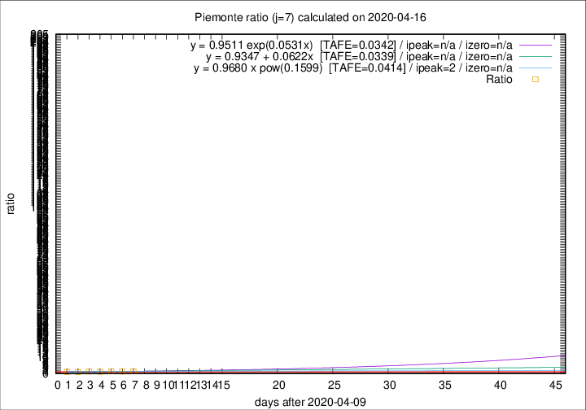

# Piemonte

Data source: https://raw.githubusercontent.com/pcm-dpc/COVID-19/master/dati-json/dpc-covid19-ita-regioni.json

Delta days analysis (j): 7

Analyses for other values of j for 2020-04-16 are avalable [here](../2020-04-16/README.md)

Analyses for Piemonte for previous dates are avalable [here](../README.md)

## Fitting 
|fit type|best fit equation|tafe|tfe|ipeak|izero|
|-------|-----|--------|------|---|---|
|linear|y = 0.9347 + 0.0622x  [TAFE=0.0339]|0.0339|0.0014|n/a|n/a|
|exp|y = 0.9511 exp(0.0531x)  [TAFE=0.0342]|0.0342|0.0008|n/a|n/a|
|pow|y = 0.9680 x pow(0.1599)  [TAFE=0.0414]|0.0414|0.0012|2|n/a|

## Data
|Date|Daily deaths|Cumulated deaths|Deaths in the last 7 days|Deaths in the 7 days before|ratio|
|----|----------|-----------|-------|--------------------|-----|
|2020-04-16|79|2094|640|471|1.3588|
|2020-04-15|88|2015|637|492|1.2947|
|2020-04-14|101|1927|608|465|1.3075|
|2020-04-13|97|1826|575|502|1.1454|
|2020-04-12|96|1729|561|484|1.1591|
|2020-04-11|101|1633|505|511|0.9883|
|2020-04-10|78|1532|489|474|1.0316|

[Download data as CSV](COVID-19_piemonte_j7_2020-04-16.csv)

Generated April 16th, 2020 at 20:09:19 UTC+0200 with https://github.com/robianc/COVID-19
