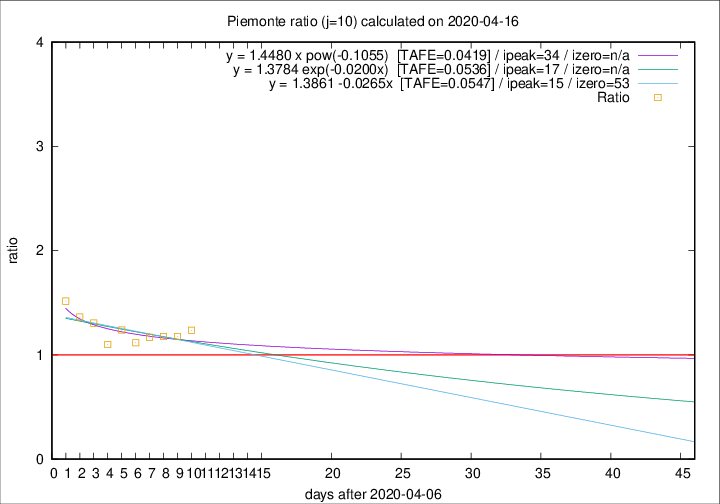

# Piemonte

Data source: https://raw.githubusercontent.com/pcm-dpc/COVID-19/master/dati-json/dpc-covid19-ita-regioni.json

Estimates in this page were made on 19/4/2020 with data available until 16/04/2020.

## Summary 

### Peak estimate 
|j|linear [TAFE]|exponential [TAFE]|power law [TAFE]|details|
|---|----|-----------|---------|-------|
|7|-|-|12/4/2020 [TAFE=0.0414]|[analysis](COVID-19_piemonte_j7_2020-04-16.md)|
|8|-|-|-|[analysis](COVID-19_piemonte_j8_2020-04-16.md)|
|9|-|-|-|[analysis](COVID-19_piemonte_j9_2020-04-16.md)|
|10|22/4/2020 [TAFE=0.0547]|24/4/2020 [TAFE=0.0536]|11/5/2020 [TAFE=0.0419]|[analysis](COVID-19_piemonte_j10_2020-04-16.md)|
|11|18/4/2020 [TAFE=0.0845]|20/4/2020 [TAFE=0.0689]|26/4/2020 [TAFE=0.0371]|[analysis](COVID-19_piemonte_j11_2020-04-16.md)|
|12|18/4/2020 [TAFE=0.0704]|20/4/2020 [TAFE=0.0555]|2/5/2020 [TAFE=0.0500]|[analysis](COVID-19_piemonte_j12_2020-04-16.md)|
|13|18/4/2020 [TAFE=0.0952]|20/4/2020 [TAFE=0.0671]|4/5/2020 [TAFE=0.0522]|[analysis](COVID-19_piemonte_j13_2020-04-16.md)|
|14|18/4/2020 [TAFE=0.1045]|20/4/2020 [TAFE=0.0626]|9/5/2020 [TAFE=0.0717]|[analysis](COVID-19_piemonte_j14_2020-04-16.md)|

Best estimator is pow with j=11 (TAFE=0.0371)
Corresponding peak date estimate is 26/4/2020 (ipeak 20)

Peak date range estimate: 6/4/2020 - 12/5/2020

### End estimate 
|j|linear [TAFE/TFE]|exponential [TAFE/TFE]|power law [TAFE/TFE]|details|
|---|----|-----------|---------|-------|
|7|-|-|-|[analysis](COVID-19_piemonte_j7_2020-04-16.md)|
|8|-|-|-|[analysis](COVID-19_piemonte_j8_2020-04-16.md)|
|9|-|-|-|[analysis](COVID-19_piemonte_j9_2020-04-16.md)|
|10|30/5/2020 [TAFE=0.0547]|-|-|[analysis](COVID-19_piemonte_j10_2020-04-16.md)|
|11|-|-|-|[analysis](COVID-19_piemonte_j11_2020-04-16.md)|
|12|-|-|-|[analysis](COVID-19_piemonte_j12_2020-04-16.md)|
|13|-|-|-|[analysis](COVID-19_piemonte_j13_2020-04-16.md)|
|14|-|-|-|[analysis](COVID-19_piemonte_j14_2020-04-16.md)|

Best estimator is linear with j=10 (TAFE=0.0547)
Corresponding end date estimate is 30/5/2020 (izero 53)

End date range estimate: 7/4/2020 - 30/5/2020

Generated April 19th, 2020 at 18:42:39 UTC+0200 with https://github.com/robianc/COVID-19
