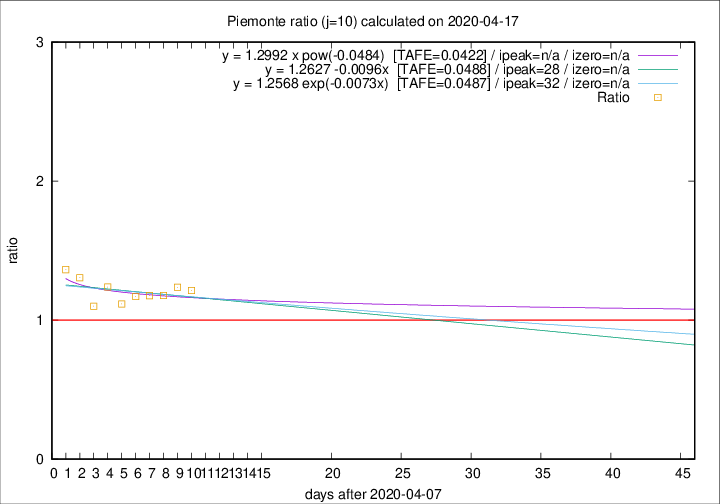

# Piemonte

Data source: https://raw.githubusercontent.com/pcm-dpc/COVID-19/master/dati-json/dpc-covid19-ita-regioni.json

Delta days analysis (j): 10

Analyses for other values of j for 2020-04-17 are avalable [here](../2020-04-17/README.md)

Analyses for Piemonte for previous dates are avalable [here](../README.md)

## Fitting 
|fit type|best fit equation|tafe|tfe|ipeak|izero|
|-------|-----|--------|------|---|---|
|linear|y = 1.2627 -0.0096x  [TAFE=0.0488]|0.0488|0.0034|28|n/a|
|exp|y = 1.2568 exp(-0.0073x)  [TAFE=0.0487]|0.0487|0.0015|32|n/a|
|pow|y = 1.2992 x pow(-0.0484)  [TAFE=0.0422]|0.0422|0.0014|n/a|n/a|

## Data
|Date|Daily deaths|Cumulated deaths|Deaths in the last 10 days|Deaths in the 10 days before|ratio|
|----|----------|-----------|-------|--------------------|-----|
|2020-04-17|77|2171|852|702|1.2137|
|2020-04-16|79|2094|843|682|1.2361|
|2020-04-15|88|2015|847|719|1.1780|
|2020-04-14|101|1927|799|679|1.1767|
|2020-04-13|97|1826|783|669|1.1704|
|2020-04-12|96|1729|746|668|1.1168|
|2020-04-11|101|1633|747|603|1.2388|
|2020-04-10|78|1532|678|616|1.1006|
|2020-04-09|76|1454|705|540|1.3056|
|2020-04-08|59|1378|694|509|1.3635|

[Download data as CSV](COVID-19_piemonte_j10_2020-04-17.csv)

Generated April 19th, 2020 at 18:42:39 UTC+0200 with https://github.com/robianc/COVID-19
