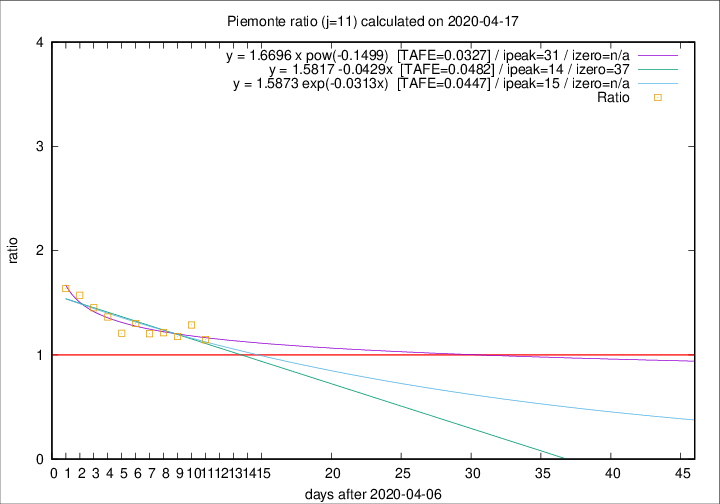

# Piemonte

Data source: https://raw.githubusercontent.com/pcm-dpc/COVID-19/master/dati-json/dpc-covid19-ita-regioni.json

Estimates in this page were made on 19/4/2020 with data available until 17/04/2020.

## Summary 

### Peak estimate 
|j|linear [TAFE]|exponential [TAFE]|power law [TAFE]|details|
|---|----|-----------|---------|-------|
|7|-|-|-|[analysis](COVID-19_piemonte_j7_2020-04-17.md)|
|8|-|-|12/4/2020 [TAFE=0.0396]|[analysis](COVID-19_piemonte_j8_2020-04-17.md)|
|9|-|-|-|[analysis](COVID-19_piemonte_j9_2020-04-17.md)|
|10|6/5/2020 [TAFE=0.0488]|10/5/2020 [TAFE=0.0487]|-|[analysis](COVID-19_piemonte_j10_2020-04-17.md)|
|11|21/4/2020 [TAFE=0.0482]|22/4/2020 [TAFE=0.0447]|8/5/2020 [TAFE=0.0327]|[analysis](COVID-19_piemonte_j11_2020-04-17.md)|
|12|20/4/2020 [TAFE=0.0669]|21/4/2020 [TAFE=0.0534]|4/5/2020 [TAFE=0.0512]|[analysis](COVID-19_piemonte_j12_2020-04-17.md)|
|13|19/4/2020 [TAFE=0.0877]|21/4/2020 [TAFE=0.0632]|4/5/2020 [TAFE=0.0466]|[analysis](COVID-19_piemonte_j13_2020-04-17.md)|
|14|19/4/2020 [TAFE=0.1031]|21/4/2020 [TAFE=0.0645]|8/5/2020 [TAFE=0.0567]|[analysis](COVID-19_piemonte_j14_2020-04-17.md)|

Best estimator is pow with j=11 (TAFE=0.0327)
Corresponding peak date estimate is 8/5/2020 (ipeak 31)

Peak date range estimate: 7/4/2020 - 11/5/2020

### End estimate 
|j|linear [TAFE/TFE]|exponential [TAFE/TFE]|power law [TAFE/TFE]|details|
|---|----|-----------|---------|-------|
|7|-|-|-|[analysis](COVID-19_piemonte_j7_2020-04-17.md)|
|8|-|-|-|[analysis](COVID-19_piemonte_j8_2020-04-17.md)|
|9|-|-|-|[analysis](COVID-19_piemonte_j9_2020-04-17.md)|
|10|-|-|-|[analysis](COVID-19_piemonte_j10_2020-04-17.md)|
|11|14/5/2020 [TAFE=0.0482]|-|-|[analysis](COVID-19_piemonte_j11_2020-04-17.md)|
|12|-|-|-|[analysis](COVID-19_piemonte_j12_2020-04-17.md)|
|13|-|-|-|[analysis](COVID-19_piemonte_j13_2020-04-17.md)|
|14|-|-|-|[analysis](COVID-19_piemonte_j14_2020-04-17.md)|

Best estimator is linear with j=11 (TAFE=0.0482)
Corresponding end date estimate is 14/5/2020 (izero 37)

End date range estimate: 7/4/2020 - 14/5/2020

Generated April 19th, 2020 at 18:42:39 UTC+0200 with https://github.com/robianc/COVID-19
