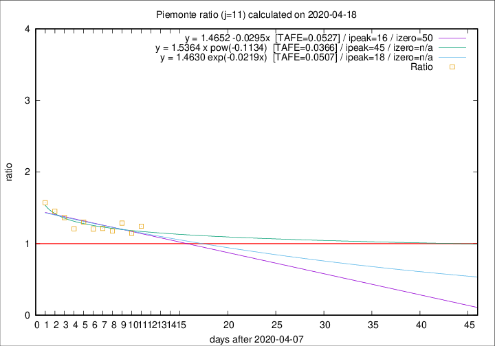

# Piemonte

Data source: https://raw.githubusercontent.com/pcm-dpc/COVID-19/master/dati-json/dpc-covid19-ita-regioni.json

Delta days analysis (j): 11

Analyses for other values of j for 2020-04-18 are avalable [here](../2020-04-18/README.md)

Analyses for Piemonte for previous dates are avalable [here](../README.md)

## Fitting 
|fit type|best fit equation|tafe|tfe|ipeak|izero|
|-------|-----|--------|------|---|---|
|linear|y = 1.4652 -0.0295x  [TAFE=0.0527]|0.0527|0.0035|16|50|
|exp|y = 1.4630 exp(-0.0219x)  [TAFE=0.0507]|0.0507|0.0018|18|n/a|
|pow|y = 1.5364 x pow(-0.1134)  [TAFE=0.0366]|0.0366|0.0009|45|n/a|

## Data
|Date|Daily deaths|Cumulated deaths|Deaths in the last 11 days|Deaths in the 11 days before|ratio|
|----|----------|-----------|-------|--------------------|-----|
|2020-04-18|81|2252|933|750|1.2440|
|2020-04-17|77|2171|920|802|1.1471|
|2020-04-16|79|2094|926|719|1.2879|
|2020-04-15|88|2015|887|754|1.1764|
|2020-04-14|101|1927|884|728|1.2143|
|2020-04-13|97|1826|843|700|1.2043|
|2020-04-12|96|1729|843|648|1.3009|
|2020-04-11|101|1633|779|645|1.2078|
|2020-04-10|78|1532|783|574|1.3641|
|2020-04-09|76|1454|770|530|1.4528|
|2020-04-08|59|1378|761|484|1.5723|

[Download data as CSV](COVID-19_piemonte_j11_2020-04-18.csv)

Generated April 19th, 2020 at 18:42:39 UTC+0200 with https://github.com/robianc/COVID-19
