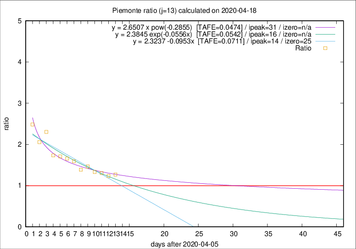

# Piemonte

Data source: https://raw.githubusercontent.com/pcm-dpc/COVID-19/master/dati-json/dpc-covid19-ita-regioni.json

Delta days analysis (j): 13

Analyses for other values of j for 2020-04-18 are avalable [here](../2020-04-18/README.md)

Analyses for Piemonte for previous dates are avalable [here](../README.md)

## Fitting 
|fit type|best fit equation|tafe|tfe|ipeak|izero|
|-------|-----|--------|------|---|---|
|linear|y = 2.3237 -0.0953x  [TAFE=0.0711]|0.0711|0.0045|14|25|
|exp|y = 2.3845 exp(-0.0556x)  [TAFE=0.0542]|0.0542|0.0025|16|n/a|
|pow|y = 2.6507 x pow(-0.2855)  [TAFE=0.0474]|0.0474|0.0018|31|n/a|

## Data
|Date|Daily deaths|Cumulated deaths|Deaths in the last 13 days|Deaths in the 13 days before|ratio|
|----|----------|-----------|-------|--------------------|-----|
|2020-04-18|81|2252|1084|853|1.2708|
|2020-04-17|77|2171|1043|845|1.2343|
|2020-04-16|79|2094|1051|805|1.3056|
|2020-04-15|88|2015|1032|774|1.3333|
|2020-04-14|101|1927|1041|711|1.4641|
|2020-04-13|97|1826|972|700|1.3886|
|2020-04-12|96|1729|980|616|1.5909|
|2020-04-11|101|1633|949|573|1.6562|
|2020-04-10|78|1532|915|536|1.7071|
|2020-04-09|76|1454|885|510|1.7353|
|2020-04-08|59|1378|929|403|2.3052|
|2020-04-07|68|1319|870|423|2.0567|
|2020-04-06|83|1251|877|353|2.4844|

[Download data as CSV](COVID-19_piemonte_j13_2020-04-18.csv)

Generated April 19th, 2020 at 18:42:39 UTC+0200 with https://github.com/robianc/COVID-19
