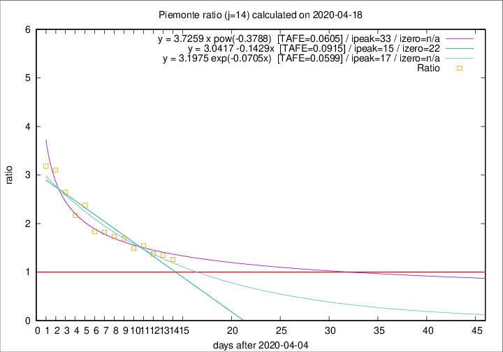

# Piemonte

Data source: https://raw.githubusercontent.com/pcm-dpc/COVID-19/master/dati-json/dpc-covid19-ita-regioni.json

Delta days analysis (j): 14

Analyses for other values of j for 2020-04-18 are avalable [here](../2020-04-18/README.md)

Analyses for Piemonte for previous dates are avalable [here](../README.md)

## Fitting 
|fit type|best fit equation|tafe|tfe|ipeak|izero|
|-------|-----|--------|------|---|---|
|linear|y = 3.0417 -0.1429x  [TAFE=0.0915]|0.0915|0.0035|15|22|
|exp|y = 3.1975 exp(-0.0705x)  [TAFE=0.0599]|0.0599|0.0024|17|n/a|
|pow|y = 3.7259 x pow(-0.3788)  [TAFE=0.0605]|0.0605|0.0029|33|n/a|

## Data
|Date|Daily deaths|Cumulated deaths|Deaths in the last 14 days|Deaths in the 14 days before|ratio|
|----|----------|-----------|-------|--------------------|-----|
|2020-04-18|81|2252|1124|890|1.2629|
|2020-04-17|77|2171|1128|834|1.3525|
|2020-04-16|79|2094|1111|808|1.3750|
|2020-04-15|88|2015|1129|732|1.5423|
|2020-04-14|101|1927|1073|721|1.4882|
|2020-04-13|97|1826|1077|638|1.6881|
|2020-04-12|96|1729|1045|603|1.7330|
|2020-04-11|101|1633|1016|558|1.8208|
|2020-04-10|78|1532|963|523|1.8413|
|2020-04-09|76|1454|1005|423|2.3759|
|2020-04-08|59|1378|929|428|2.1706|
|2020-04-07|68|1319|945|357|2.6471|
|2020-04-06|83|1251|936|302|3.0993|
|2020-04-05|40|1168|885|278|3.1835|

[Download data as CSV](COVID-19_piemonte_j14_2020-04-18.csv)

Generated April 19th, 2020 at 18:42:39 UTC+0200 with https://github.com/robianc/COVID-19
