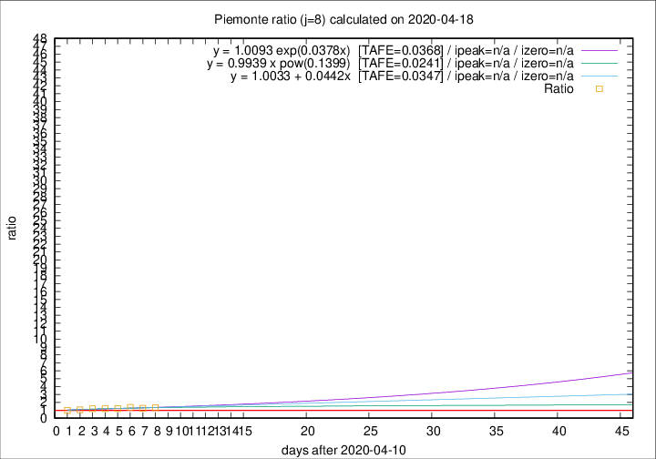

# Piemonte

Data source: https://raw.githubusercontent.com/pcm-dpc/COVID-19/master/dati-json/dpc-covid19-ita-regioni.json

Delta days analysis (j): 8

Analyses for other values of j for 2020-04-18 are avalable [here](../2020-04-18/README.md)

Analyses for Piemonte for previous dates are avalable [here](../README.md)

## Fitting 
|fit type|best fit equation|tafe|tfe|ipeak|izero|
|-------|-----|--------|------|---|---|
|linear|y = 1.0033 + 0.0442x  [TAFE=0.0347]|0.0347|0.0021|n/a|n/a|
|exp|y = 1.0093 exp(0.0378x)  [TAFE=0.0368]|0.0368|0.0009|n/a|n/a|
|pow|y = 0.9939 x pow(0.1399)  [TAFE=0.0241]|0.0241|0.0004|n/a|n/a|

## Data
|Date|Daily deaths|Cumulated deaths|Deaths in the last 8 days|Deaths in the 8 days before|ratio|
|----|----------|-----------|-------|--------------------|-----|
|2020-04-18|81|2252|720|549|1.3115|
|2020-04-17|77|2171|717|568|1.2623|
|2020-04-16|79|2094|716|524|1.3664|
|2020-04-15|88|2015|696|570|1.2211|
|2020-04-14|101|1927|676|567|1.1922|
|2020-04-13|97|1826|658|551|1.1942|
|2020-04-12|96|1729|601|559|1.0751|
|2020-04-11|101|1633|590|594|0.9933|

[Download data as CSV](COVID-19_piemonte_j8_2020-04-18.csv)

Generated April 19th, 2020 at 18:42:39 UTC+0200 with https://github.com/robianc/COVID-19
