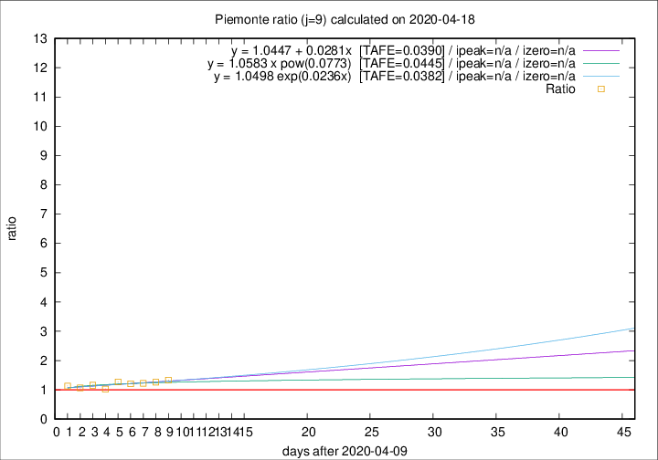

# Piemonte

Data source: https://raw.githubusercontent.com/pcm-dpc/COVID-19/master/dati-json/dpc-covid19-ita-regioni.json

Delta days analysis (j): 9

Analyses for other values of j for 2020-04-18 are avalable [here](../2020-04-18/README.md)

Analyses for Piemonte for previous dates are avalable [here](../README.md)

## Fitting 
|fit type|best fit equation|tafe|tfe|ipeak|izero|
|-------|-----|--------|------|---|---|
|linear|y = 1.0447 + 0.0281x  [TAFE=0.0390]|0.0390|0.0028|n/a|n/a|
|exp|y = 1.0498 exp(0.0236x)  [TAFE=0.0382]|0.0382|0.0013|n/a|n/a|
|pow|y = 1.0583 x pow(0.0773)  [TAFE=0.0445]|0.0445|0.0018|n/a|n/a|

## Data
|Date|Daily deaths|Cumulated deaths|Deaths in the last 9 days|Deaths in the 9 days before|ratio|
|----|----------|-----------|-------|--------------------|-----|
|2020-04-18|81|2252|798|600|1.3300|
|2020-04-17|77|2171|793|629|1.2607|
|2020-04-16|79|2094|775|635|1.2205|
|2020-04-15|88|2015|764|634|1.2050|
|2020-04-14|101|1927|759|599|1.2671|
|2020-04-13|97|1826|698|679|1.0280|
|2020-04-12|96|1729|686|594|1.1549|
|2020-04-11|101|1633|650|609|1.0673|
|2020-04-10|78|1532|646|571|1.1313|

[Download data as CSV](COVID-19_piemonte_j9_2020-04-18.csv)

Generated April 19th, 2020 at 18:42:39 UTC+0200 with https://github.com/robianc/COVID-19
