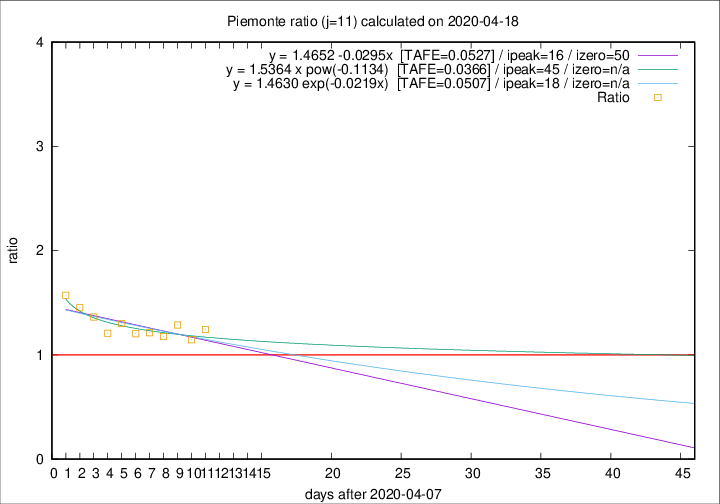

# Piemonte

Data source: https://raw.githubusercontent.com/pcm-dpc/COVID-19/master/dati-json/dpc-covid19-ita-regioni.json

Estimates in this page were made on 19/4/2020 with data available until 18/04/2020.

## Summary 

### Peak estimate 
|j|linear [TAFE]|exponential [TAFE]|power law [TAFE]|details|
|---|----|-----------|---------|-------|
|7|-|-|-|[analysis](COVID-19_piemonte_j7_2020-04-18.md)|
|8|-|-|-|[analysis](COVID-19_piemonte_j8_2020-04-18.md)|
|9|-|-|-|[analysis](COVID-19_piemonte_j9_2020-04-18.md)|
|10|-|-|-|[analysis](COVID-19_piemonte_j10_2020-04-18.md)|
|11|24/4/2020 [TAFE=0.0527]|26/4/2020 [TAFE=0.0507]|23/5/2020 [TAFE=0.0366]|[analysis](COVID-19_piemonte_j11_2020-04-18.md)|
|12|21/4/2020 [TAFE=0.0735]|22/4/2020 [TAFE=0.0610]|3/5/2020 [TAFE=0.0383]|[analysis](COVID-19_piemonte_j12_2020-04-18.md)|
|13|20/4/2020 [TAFE=0.0711]|22/4/2020 [TAFE=0.0542]|7/5/2020 [TAFE=0.0474]|[analysis](COVID-19_piemonte_j13_2020-04-18.md)|
|14|20/4/2020 [TAFE=0.0915]|22/4/2020 [TAFE=0.0599]|8/5/2020 [TAFE=0.0605]|[analysis](COVID-19_piemonte_j14_2020-04-18.md)|

Best estimator is pow with j=11 (TAFE=0.0366)
Corresponding peak date estimate is 23/5/2020 (ipeak 45)

Peak date range estimate: 8/4/2020 - 23/5/2020

### End estimate 
|j|linear [TAFE/TFE]|exponential [TAFE/TFE]|power law [TAFE/TFE]|details|
|---|----|-----------|---------|-------|
|7|-|-|-|[analysis](COVID-19_piemonte_j7_2020-04-18.md)|
|8|-|-|-|[analysis](COVID-19_piemonte_j8_2020-04-18.md)|
|9|-|-|-|[analysis](COVID-19_piemonte_j9_2020-04-18.md)|
|10|-|-|-|[analysis](COVID-19_piemonte_j10_2020-04-18.md)|
|11|28/5/2020 [TAFE=0.0527]|-|-|[analysis](COVID-19_piemonte_j11_2020-04-18.md)|
|12|-|-|-|[analysis](COVID-19_piemonte_j12_2020-04-18.md)|
|13|-|-|-|[analysis](COVID-19_piemonte_j13_2020-04-18.md)|
|14|-|-|-|[analysis](COVID-19_piemonte_j14_2020-04-18.md)|

Best estimator is linear with j=11 (TAFE=0.0527)
Corresponding end date estimate is 28/5/2020 (izero 50)

End date range estimate: 8/4/2020 - 28/5/2020

Generated April 19th, 2020 at 18:42:39 UTC+0200 with https://github.com/robianc/COVID-19
