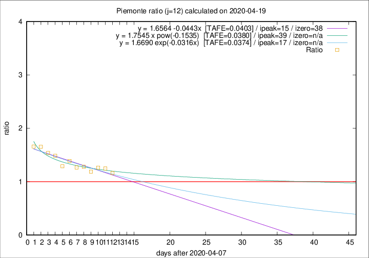

# Piemonte

Data source: https://raw.githubusercontent.com/pcm-dpc/COVID-19/master/dati-json/dpc-covid19-ita-regioni.json

Delta days analysis (j): 12

Analyses for other values of j for 2020-04-19 are avalable [here](../2020-04-19/README.md)

Analyses for Piemonte for previous dates are avalable [here](../README.md)

## Fitting 
|fit type|best fit equation|tafe|tfe|ipeak|izero|
|-------|-----|--------|------|---|---|
|linear|y = 1.6564 -0.0443x  [TAFE=0.0403]|0.0403|0.0020|15|38|
|exp|y = 1.6690 exp(-0.0316x)  [TAFE=0.0374]|0.0374|0.0013|17|n/a|
|pow|y = 1.7545 x pow(-0.1535)  [TAFE=0.0380]|0.0380|0.0007|39|n/a|

## Data
|Date|Daily deaths|Cumulated deaths|Deaths in the last 12 days|Deaths in the 12 days before|ratio|
|----|----------|-----------|-------|--------------------|-----|
|2020-04-19|79|2331|1012|870|1.1632|
|2020-04-18|81|2252|1001|802|1.2481|
|2020-04-17|77|2171|1003|794|1.2632|
|2020-04-16|79|2094|966|813|1.1882|
|2020-04-15|88|2015|972|760|1.2789|
|2020-04-14|101|1927|944|745|1.2671|
|2020-04-13|97|1826|940|677|1.3885|
|2020-04-12|96|1729|875|679|1.2887|
|2020-04-11|101|1633|884|595|1.4857|
|2020-04-10|78|1532|848|551|1.5390|
|2020-04-09|76|1454|837|506|1.6542|
|2020-04-08|59|1378|809|488|1.6578|

[Download data as CSV](COVID-19_piemonte_j12_2020-04-19.csv)

Generated April 19th, 2020 at 18:42:39 UTC+0200 with https://github.com/robianc/COVID-19
