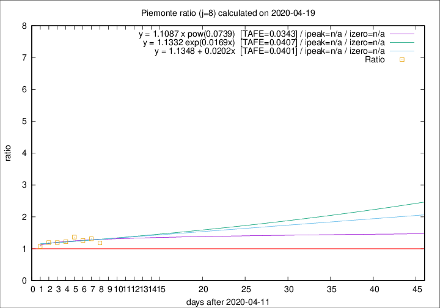

# Piemonte

Data source: https://raw.githubusercontent.com/pcm-dpc/COVID-19/master/dati-json/dpc-covid19-ita-regioni.json

Delta days analysis (j): 8

Analyses for other values of j for 2020-04-19 are avalable [here](../2020-04-19/README.md)

Analyses for Piemonte for previous dates are avalable [here](../README.md)

## Fitting 
|fit type|best fit equation|tafe|tfe|ipeak|izero|
|-------|-----|--------|------|---|---|
|linear|y = 1.1348 + 0.0202x  [TAFE=0.0401]|0.0401|0.0031|n/a|n/a|
|exp|y = 1.1332 exp(0.0169x)  [TAFE=0.0407]|0.0407|0.0014|n/a|n/a|
|pow|y = 1.1087 x pow(0.0739)  [TAFE=0.0343]|0.0343|0.0011|n/a|n/a|

## Data
|Date|Daily deaths|Cumulated deaths|Deaths in the last 8 days|Deaths in the 8 days before|ratio|
|----|----------|-----------|-------|--------------------|-----|
|2020-04-19|79|2331|698|590|1.1831|
|2020-04-18|81|2252|720|549|1.3115|
|2020-04-17|77|2171|717|568|1.2623|
|2020-04-16|79|2094|716|524|1.3664|
|2020-04-15|88|2015|696|570|1.2211|
|2020-04-14|101|1927|676|567|1.1922|
|2020-04-13|97|1826|658|551|1.1942|
|2020-04-12|96|1729|601|559|1.0751|

[Download data as CSV](COVID-19_piemonte_j8_2020-04-19.csv)

Generated April 19th, 2020 at 18:42:39 UTC+0200 with https://github.com/robianc/COVID-19
