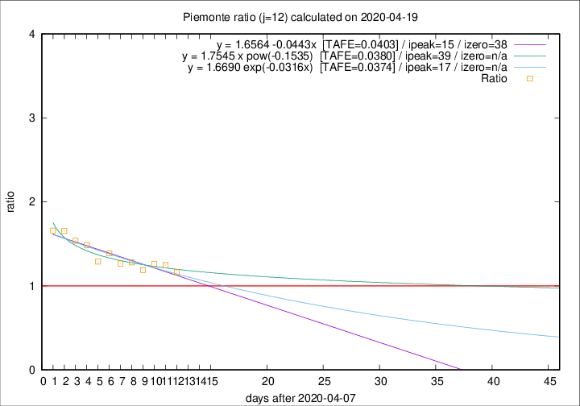

# Piemonte

Data source: https://raw.githubusercontent.com/pcm-dpc/COVID-19/master/dati-json/dpc-covid19-ita-regioni.json

Estimates in this page were made on 19/4/2020 with data available until 19/04/2020.

## Summary 

### Peak estimate 
|j|linear [TAFE]|exponential [TAFE]|power law [TAFE]|details|
|---|----|-----------|---------|-------|
|7|6/5/2020 [TAFE=0.0641]|7/5/2020 [TAFE=0.0653]|-|[analysis](COVID-19_piemonte_j7_2020-04-19.md)|
|8|-|-|-|[analysis](COVID-19_piemonte_j8_2020-04-19.md)|
|9|-|-|-|[analysis](COVID-19_piemonte_j9_2020-04-19.md)|
|10|-|-|-|[analysis](COVID-19_piemonte_j10_2020-04-19.md)|
|11|2/5/2020 [TAFE=0.0501]|5/5/2020 [TAFE=0.0497]|-|[analysis](COVID-19_piemonte_j11_2020-04-19.md)|
|12|23/4/2020 [TAFE=0.0403]|25/4/2020 [TAFE=0.0374]|17/5/2020 [TAFE=0.0380]|[analysis](COVID-19_piemonte_j12_2020-04-19.md)|
|13|22/4/2020 [TAFE=0.0593]|23/4/2020 [TAFE=0.0463]|10/5/2020 [TAFE=0.0490]|[analysis](COVID-19_piemonte_j13_2020-04-19.md)|
|14|21/4/2020 [TAFE=0.0886]|23/4/2020 [TAFE=0.0628]|7/5/2020 [TAFE=0.0444]|[analysis](COVID-19_piemonte_j14_2020-04-19.md)|

Best estimator is exp with j=12 (TAFE=0.0374)
Corresponding peak date estimate is 25/4/2020 (ipeak 17)

Peak date range estimate: 8/4/2020 - 17/5/2020

### End estimate 
|j|linear [TAFE/TFE]|exponential [TAFE/TFE]|power law [TAFE/TFE]|details|
|---|----|-----------|---------|-------|
|7|21/7/2020 [TAFE=0.0641]|-|-|[analysis](COVID-19_piemonte_j7_2020-04-19.md)|
|8|-|-|-|[analysis](COVID-19_piemonte_j8_2020-04-19.md)|
|9|-|-|-|[analysis](COVID-19_piemonte_j9_2020-04-19.md)|
|10|-|-|-|[analysis](COVID-19_piemonte_j10_2020-04-19.md)|
|11|5/7/2020 [TAFE=0.0501]|-|-|[analysis](COVID-19_piemonte_j11_2020-04-19.md)|
|12|16/5/2020 [TAFE=0.0403]|-|-|[analysis](COVID-19_piemonte_j12_2020-04-19.md)|
|13|-|-|-|[analysis](COVID-19_piemonte_j13_2020-04-19.md)|
|14|-|-|-|[analysis](COVID-19_piemonte_j14_2020-04-19.md)|

Best estimator is linear with j=12 (TAFE=0.0403)
Corresponding end date estimate is 16/5/2020 (izero 38)

End date range estimate: 8/4/2020 - 16/7/2020

Generated April 19th, 2020 at 18:42:39 UTC+0200 with https://github.com/robianc/COVID-19
