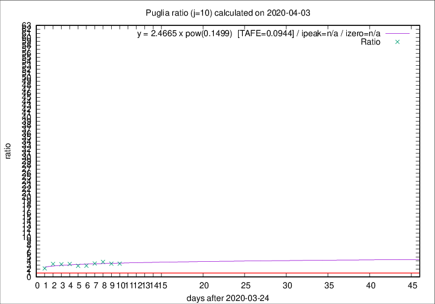

# Puglia

Data source: https://raw.githubusercontent.com/pcm-dpc/COVID-19/master/dati-json/dpc-covid19-ita-regioni.json

Delta days analysis (j): 10

Analyses for other values of j for 2020-04-03 are avalable [here](../2020-04-03/README.md)

Analyses for Puglia for previous dates are avalable [here](../README.md)

## Fitting 
|fit type|best fit equation|tafe|tfe|ipeak|izero|
|-------|-----|--------|------|---|---|
|pow|y = 2.4665 x pow(0.1499)  [TAFE=0.0944]|0.0944|0.0057|n/a|n/a|

## Data
|Date|Daily deaths|Cumulated deaths|Deaths in the last 10 days|Deaths in the 10 days before|ratio|
|----|----------|-----------|-------|--------------------|-----|
|2020-04-03|20|164|120|36|3.3333|
|2020-04-02|15|144|107|32|3.3438|
|2020-04-01|19|129|98|26|3.7692|
|2020-03-31|19|110|81|24|3.3750|
|2020-03-30|5|91|65|23|2.8261|
|2020-03-29|15|86|61|22|2.7727|
|2020-03-28|2|71|52|16|3.2500|
|2020-03-27|4|69|51|16|3.1875|
|2020-03-26|17|65|49|15|3.2667|
|2020-03-25|4|48|32|15|2.1333|

[Download data as CSV](COVID-19_puglia_j10_2020-04-03.csv)

Generated April 14th, 2020 at 19:16:04 UTC+0200 with https://github.com/robianc/COVID-19
