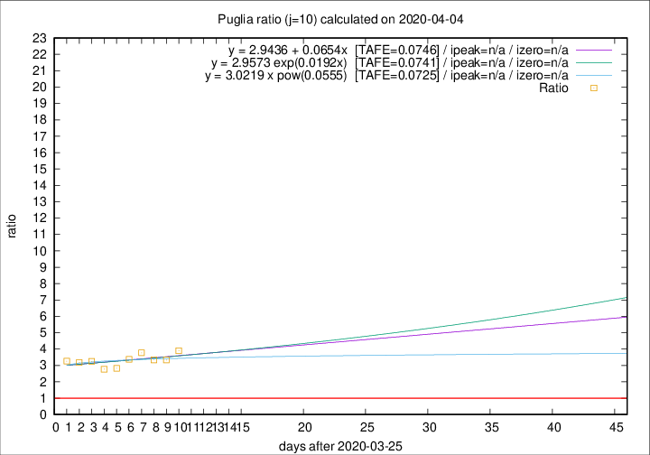

# Puglia

Data source: https://raw.githubusercontent.com/pcm-dpc/COVID-19/master/dati-json/dpc-covid19-ita-regioni.json

Delta days analysis (j): 10

Analyses for other values of j for 2020-04-04 are avalable [here](../2020-04-04/README.md)

Analyses for Puglia for previous dates are avalable [here](../README.md)

## Fitting 
|fit type|best fit equation|tafe|tfe|ipeak|izero|
|-------|-----|--------|------|---|---|
|linear|y = 2.9436 + 0.0654x  [TAFE=0.0746]|0.0746|0.0073|n/a|n/a|
|exp|y = 2.9573 exp(0.0192x)  [TAFE=0.0741]|0.0741|0.0038|n/a|n/a|
|pow|y = 3.0219 x pow(0.0555)  [TAFE=0.0725]|0.0725|0.0044|n/a|n/a|

## Data
|Date|Daily deaths|Cumulated deaths|Deaths in the last 10 days|Deaths in the 10 days before|ratio|
|----|----------|-----------|-------|--------------------|-----|
|2020-04-04|9|173|125|32|3.9062|
|2020-04-03|20|164|120|36|3.3333|
|2020-04-02|15|144|107|32|3.3438|
|2020-04-01|19|129|98|26|3.7692|
|2020-03-31|19|110|81|24|3.3750|
|2020-03-30|5|91|65|23|2.8261|
|2020-03-29|15|86|61|22|2.7727|
|2020-03-28|2|71|52|16|3.2500|
|2020-03-27|4|69|51|16|3.1875|
|2020-03-26|17|65|49|15|3.2667|

[Download data as CSV](COVID-19_puglia_j10_2020-04-04.csv)

Generated April 14th, 2020 at 19:16:04 UTC+0200 with https://github.com/robianc/COVID-19
