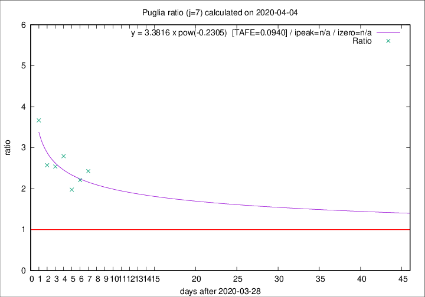

# Puglia

Data source: https://raw.githubusercontent.com/pcm-dpc/COVID-19/master/dati-json/dpc-covid19-ita-regioni.json

Estimates in this page were made on 10/4/2020 with data available until 04/04/2020.

## Summary 

### Peak estimate 
|j|linear [TAFE]|exponential [TAFE]|power law [TAFE]|details|
|---|----|-----------|---------|-------|
|7|11/4/2020 [TAFE=0.1212]|17/4/2020 [TAFE=0.1151]|-|[analysis](COVID-19_puglia_j7_2020-04-04.md)|
|8|-|-|-|[analysis](COVID-19_puglia_j8_2020-04-04.md)|
|9|-|-|-|[analysis](COVID-19_puglia_j9_2020-04-04.md)|
|10|-|-|-|[analysis](COVID-19_puglia_j10_2020-04-04.md)|
|11|-|-|-|[analysis](COVID-19_puglia_j11_2020-04-04.md)|
|12|13/4/2020 [TAFE=0.2603]|2/5/2020 [TAFE=0.2339]|-|[analysis](COVID-19_puglia_j12_2020-04-04.md)|
|13|10/4/2020 [TAFE=0.2662]|25/4/2020 [TAFE=0.2325]|-|[analysis](COVID-19_puglia_j13_2020-04-04.md)|
|14|-|-|-||

Best estimator is exp with j=7 (TAFE=0.1151)
Corresponding peak date estimate is 17/4/2020 (ipeak 19)

Peak date range estimate: 29/3/2020 - 7/5/2020

### End estimate 
|j|linear [TAFE/TFE]|exponential [TAFE/TFE]|power law [TAFE/TFE]|details|
|---|----|-----------|---------|-------|
|7|17/4/2020 [TAFE=0.1212]|-|-|[analysis](COVID-19_puglia_j7_2020-04-04.md)|
|8|-|-|-|[analysis](COVID-19_puglia_j8_2020-04-04.md)|
|9|-|-|-|[analysis](COVID-19_puglia_j9_2020-04-04.md)|
|10|-|-|-|[analysis](COVID-19_puglia_j10_2020-04-04.md)|
|11|-|-|-|[analysis](COVID-19_puglia_j11_2020-04-04.md)|
|12|-|-|-|[analysis](COVID-19_puglia_j12_2020-04-04.md)|
|13|-|-|-|[analysis](COVID-19_puglia_j13_2020-04-04.md)|
|14|-|-|-||

Best estimator is linear with j=7 (TAFE=0.1212)
Corresponding end date estimate is 17/4/2020 (izero 19)

End date range estimate: 29/3/2020 - 22/4/2020

Generated April 10th, 2020 at 17:26:10 UTC+0200 with https://github.com/robianc/COVID-19
