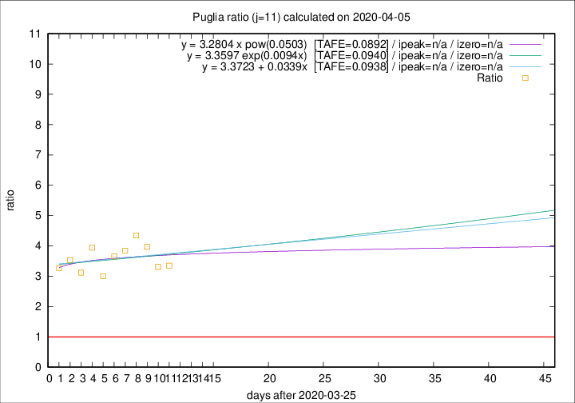

# Puglia

Data source: https://raw.githubusercontent.com/pcm-dpc/COVID-19/master/dati-json/dpc-covid19-ita-regioni.json

Delta days analysis (j): 11

Analyses for other values of j for 2020-04-05 are avalable [here](../README.md)

Analyses for Puglia for previous dates are avalable [here](../../README.md)

## Fitting 
|fit type|best fit equation|tafe|tfe|ipeak|izero|
|-------|-----|--------|------|---|---|
|linear|y = 3.3723 + 0.0339x  [TAFE=0.0938]|0.0938|0.0113|n/a|n/a|
|exp|y = 3.3597 exp(0.0094x)  [TAFE=0.0940]|0.0940|0.0058|n/a|n/a|
|pow|y = 3.2804 x pow(0.0503)  [TAFE=0.0892]|0.0892|0.0053|n/a|n/a|

## Data
|Date|Daily deaths|Cumulated deaths|Deaths in the last 11 days|Deaths in the 11 days before|ratio|
|----|----------|-----------|-------|--------------------|-----|
|2020-04-05|9|182|134|40|3.3500|
|2020-04-04|9|173|129|39|3.3077|
|2020-04-03|20|164|127|32|3.9688|
|2020-04-02|15|144|113|26|4.3462|
|2020-04-01|19|129|100|26|3.8462|
|2020-03-31|19|110|84|23|3.6522|
|2020-03-30|5|91|66|22|3.0000|
|2020-03-29|15|86|67|17|3.9412|
|2020-03-28|2|71|53|17|3.1176|
|2020-03-27|4|69|53|15|3.5333|
|2020-03-26|17|65|49|15|3.2667|

[Download data as CSV](COVID-19_puglia_j11_2020-04-05.csv)

Generated April 12th, 2020 at 16:28:18 UTC+0200 with https://github.com/robianc/COVID-19
