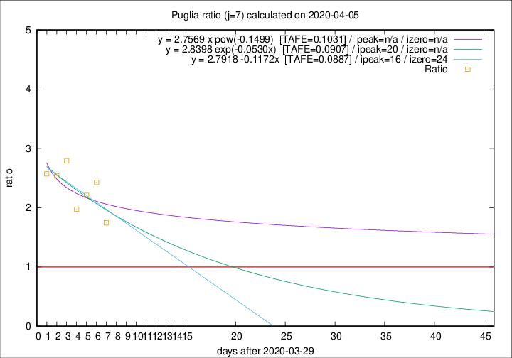

# Puglia

Data source: https://raw.githubusercontent.com/pcm-dpc/COVID-19/master/dati-json/dpc-covid19-ita-regioni.json

Delta days analysis (j): 7

Analyses for other values of j for 2020-04-05 are avalable [here](../2020-04-05/README.md)

Analyses for Puglia for previous dates are avalable [here](../README.md)

## Fitting 
|fit type|best fit equation|tafe|tfe|ipeak|izero|
|-------|-----|--------|------|---|---|
|linear|y = 2.7918 -0.1172x  [TAFE=0.0887]|0.0887|0.0122|16|24|
|exp|y = 2.8398 exp(-0.0530x)  [TAFE=0.0907]|0.0907|0.0062|20|n/a|
|pow|y = 2.7569 x pow(-0.1499)  [TAFE=0.1031]|0.1031|0.0072|n/a|n/a|

## Data
|Date|Daily deaths|Cumulated deaths|Deaths in the last 7 days|Deaths in the 7 days before|ratio|
|----|----------|-----------|-------|--------------------|-----|
|2020-04-05|9|182|96|55|1.7455|
|2020-04-04|9|173|102|42|2.4286|
|2020-04-03|20|164|95|43|2.2093|
|2020-04-02|15|144|79|40|1.9750|
|2020-04-01|19|129|81|29|2.7931|
|2020-03-31|19|110|66|26|2.5385|
|2020-03-30|5|91|54|21|2.5714|

[Download data as CSV](COVID-19_puglia_j7_2020-04-05.csv)

Generated April 19th, 2020 at 18:42:39 UTC+0200 with https://github.com/robianc/COVID-19
