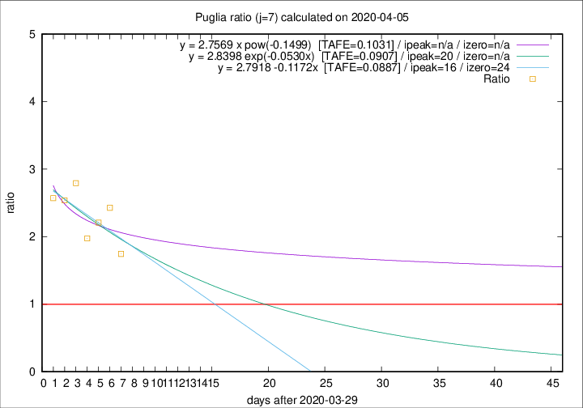

# Puglia

Data source: https://raw.githubusercontent.com/pcm-dpc/COVID-19/master/dati-json/dpc-covid19-ita-regioni.json

Estimates in this page were made on 9/4/2020 with data available until 05/04/2020.

## Summary 

### Peak estimate 
|j|linear [TAFE]|exponential [TAFE]|power law [TAFE]|details|
|---|----|-----------|---------|-------|
|7|15/4/2020 [TAFE=0.0887]|19/4/2020 [TAFE=0.0907]|-|[analysis](COVID-19_puglia_j7_2020-04-05.md)|
|8|6/5/2020 [TAFE=0.1379]|24/5/2020 [TAFE=0.1340]|-|[analysis](COVID-19_puglia_j8_2020-04-05.md)|
|9|-|-|-|[analysis](COVID-19_puglia_j9_2020-04-05.md)|
|10|-|-|-|[analysis](COVID-19_puglia_j10_2020-04-05.md)|
|11|-|-|-|[analysis](COVID-19_puglia_j11_2020-04-05.md)|
|12|17/4/2020 [TAFE=0.2307]|11/5/2020 [TAFE=0.2041]|-|[analysis](COVID-19_puglia_j12_2020-04-05.md)|
|13|13/4/2020 [TAFE=0.2482]|1/5/2020 [TAFE=0.2132]|-|[analysis](COVID-19_puglia_j13_2020-04-05.md)|
|14|11/4/2020 [TAFE=0.2496]|25/4/2020 [TAFE=0.2077]|-|[analysis](COVID-19_puglia_j14_2020-04-05.md)|

Best estimator is linear with j=7 (TAFE=0.0887)
Corresponding peak date estimate is 15/4/2020 (ipeak 16)

Peak date range estimate: 30/3/2020 - 25/5/2020

### End estimate 
|j|linear [TAFE/TFE]|exponential [TAFE/TFE]|power law [TAFE/TFE]|details|
|---|----|-----------|---------|-------|
|7|23/4/2020 [TAFE=0.0887]|-|-|[analysis](COVID-19_puglia_j7_2020-04-05.md)|
|8|-|-|-|[analysis](COVID-19_puglia_j8_2020-04-05.md)|
|9|-|-|-|[analysis](COVID-19_puglia_j9_2020-04-05.md)|
|10|-|-|-|[analysis](COVID-19_puglia_j10_2020-04-05.md)|
|11|-|-|-|[analysis](COVID-19_puglia_j11_2020-04-05.md)|
|12|-|-|-|[analysis](COVID-19_puglia_j12_2020-04-05.md)|
|13|-|-|-|[analysis](COVID-19_puglia_j13_2020-04-05.md)|
|14|-|-|-|[analysis](COVID-19_puglia_j14_2020-04-05.md)|

Best estimator is linear with j=7 (TAFE=0.0887)
Corresponding end date estimate is 23/4/2020 (izero 24)

End date range estimate: 30/3/2020 - 26/5/2020

Generated April 9th, 2020 at 16:40:48 UTC+0200 with https://github.com/robianc/COVID-19
