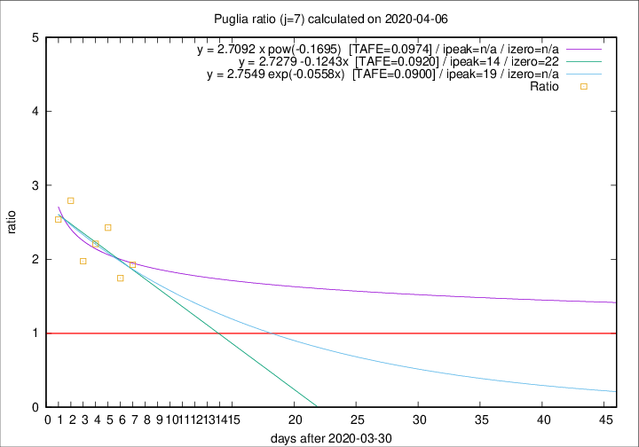

# Puglia

Data source: https://raw.githubusercontent.com/pcm-dpc/COVID-19/master/dati-json/dpc-covid19-ita-regioni.json

Estimates in this page were made on 14/4/2020 with data available until 06/04/2020.

## Summary 

### Peak estimate 
|j|linear [TAFE]|exponential [TAFE]|power law [TAFE]|details|
|---|----|-----------|---------|-------|
|7|14/4/2020 [TAFE=0.0920]|19/4/2020 [TAFE=0.0900]|-|[analysis](COVID-19_puglia_j7_2020-04-06.md)|
|8|15/4/2020 [TAFE=0.1191]|20/4/2020 [TAFE=0.1200]|-|[analysis](COVID-19_puglia_j8_2020-04-06.md)|
|9|17/5/2020 [TAFE=0.1331]|2/6/2020 [TAFE=0.1318]|-|[analysis](COVID-19_puglia_j9_2020-04-06.md)|
|10|15/6/2020 [TAFE=0.1376]|3/7/2020 [TAFE=0.1373]|-|[analysis](COVID-19_puglia_j10_2020-04-06.md)|
|11|-|-|-|[analysis](COVID-19_puglia_j11_2020-04-06.md)|
|12|4/5/2020 [TAFE=0.1580]|21/6/2020 [TAFE=0.1487]|-|[analysis](COVID-19_puglia_j12_2020-04-06.md)|
|13|13/4/2020 [TAFE=0.2543]|1/5/2020 [TAFE=0.2145]|-|[analysis](COVID-19_puglia_j13_2020-04-06.md)|
|14|11/4/2020 [TAFE=0.2674]|27/4/2020 [TAFE=0.2127]|-|[analysis](COVID-19_puglia_j14_2020-04-06.md)|

Best estimator is exp with j=7 (TAFE=0.0900)
Corresponding peak date estimate is 19/4/2020 (ipeak 19)

Peak date range estimate: 31/3/2020 - 6/7/2020

### End estimate 
|j|linear [TAFE/TFE]|exponential [TAFE/TFE]|power law [TAFE/TFE]|details|
|---|----|-----------|---------|-------|
|7|22/4/2020 [TAFE=0.0920]|-|-|[analysis](COVID-19_puglia_j7_2020-04-06.md)|
|8|-|-|-|[analysis](COVID-19_puglia_j8_2020-04-06.md)|
|9|-|-|-|[analysis](COVID-19_puglia_j9_2020-04-06.md)|
|10|-|-|-|[analysis](COVID-19_puglia_j10_2020-04-06.md)|
|11|-|-|-|[analysis](COVID-19_puglia_j11_2020-04-06.md)|
|12|-|-|-|[analysis](COVID-19_puglia_j12_2020-04-06.md)|
|13|-|-|-|[analysis](COVID-19_puglia_j13_2020-04-06.md)|
|14|-|-|-|[analysis](COVID-19_puglia_j14_2020-04-06.md)|

Best estimator is linear with j=7 (TAFE=0.0920)
Corresponding end date estimate is 22/4/2020 (izero 22)

End date range estimate: 31/3/2020 - 10/6/2020

Generated April 14th, 2020 at 19:16:04 UTC+0200 with https://github.com/robianc/COVID-19
