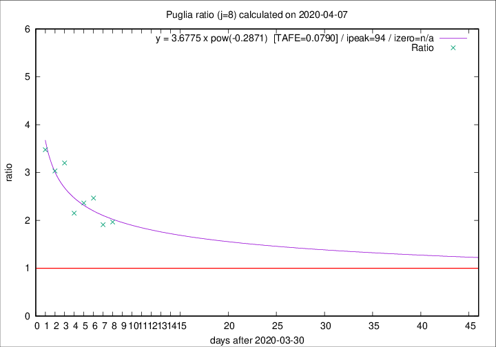

# Puglia

Data source: https://raw.githubusercontent.com/pcm-dpc/COVID-19/master/dati-json/dpc-covid19-ita-regioni.json

Delta days analysis (j): 8

## Fitting 
|fit type|best fit equation|tafe|tfe|ipeak|izero|
|-------|-----|--------|------|---|---|
|pow|y = 3.6775 x pow(-0.2871)  [TAFE=0.0790]|0.0790|0.0047|94|n/a|

## Data
|Date|Daily deaths|Cumulated deaths|Deaths in the last 8 days|Deaths in the 8 days before|ratio|
|----|----------|-----------|-------|--------------------|-----|
|2020-04-07|14|209|118|60|1.9667|
|2020-04-06|13|195|109|57|1.9123|
|2020-04-05|9|182|111|45|2.4667|
|2020-04-04|9|173|104|44|2.3636|
|2020-04-03|20|164|99|46|2.1522|
|2020-04-02|15|144|96|30|3.2000|
|2020-04-01|19|129|85|28|3.0357|
|2020-03-31|19|110|73|21|3.4762|

[Download data as CSV](COVID-19_puglia_j8_2020-04-07.csv)

Generated April 8th, 2020 at 23:43:36 UTC+0200 with https://github.com/robianc/COVID-19
