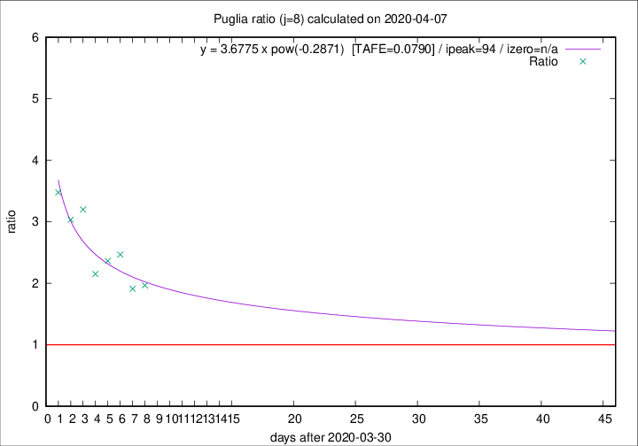

# Puglia

Data source: https://raw.githubusercontent.com/pcm-dpc/COVID-19/master/dati-json/dpc-covid19-ita-regioni.json

Estimates in this page were made on 10/4/2020 with data available until 07/04/2020.

## Summary 

### Peak estimate 
|j|linear [TAFE]|exponential [TAFE]|power law [TAFE]|details|
|---|----|-----------|---------|-------|
|7|12/4/2020 [TAFE=0.1018]|15/4/2020 [TAFE=0.1002]|11/6/2020 [TAFE=0.1034]|[analysis](COVID-19_puglia_j7_2020-04-07.md)|
|8|12/4/2020 [TAFE=0.0848]|16/4/2020 [TAFE=0.0766]|3/7/2020 [TAFE=0.0790]|[analysis](COVID-19_puglia_j8_2020-04-07.md)|
|9|22/4/2020 [TAFE=0.1449]|30/4/2020 [TAFE=0.1432]|-|[analysis](COVID-19_puglia_j9_2020-04-07.md)|
|10|16/5/2020 [TAFE=0.1436]|5/6/2020 [TAFE=0.1416]|-|[analysis](COVID-19_puglia_j10_2020-04-07.md)|
|11|12/5/2020 [TAFE=0.1238]|2/6/2020 [TAFE=0.1260]|-|[analysis](COVID-19_puglia_j11_2020-04-07.md)|
|12|25/6/2020 [TAFE=0.1296]|-|-|[analysis](COVID-19_puglia_j12_2020-04-07.md)|
|13|15/4/2020 [TAFE=0.2397]|6/5/2020 [TAFE=0.1919]|-|[analysis](COVID-19_puglia_j13_2020-04-07.md)|
|14|14/4/2020 [TAFE=0.2269]|30/4/2020 [TAFE=0.1845]|-|[analysis](COVID-19_puglia_j14_2020-04-07.md)|

Best estimator is exp with j=8 (TAFE=0.0766)
Corresponding peak date estimate is 16/4/2020 (ipeak 16)

Peak date range estimate: 31/3/2020 - 3/7/2020

### End estimate 
|j|linear [TAFE/TFE]|exponential [TAFE/TFE]|power law [TAFE/TFE]|details|
|---|----|-----------|---------|-------|
|7|19/4/2020 [TAFE=0.1018]|-|-|[analysis](COVID-19_puglia_j7_2020-04-07.md)|
|8|17/4/2020 [TAFE=0.0848]|-|-|[analysis](COVID-19_puglia_j8_2020-04-07.md)|
|9|-|-|-|[analysis](COVID-19_puglia_j9_2020-04-07.md)|
|10|-|-|-|[analysis](COVID-19_puglia_j10_2020-04-07.md)|
|11|-|-|-|[analysis](COVID-19_puglia_j11_2020-04-07.md)|
|12|-|-|-|[analysis](COVID-19_puglia_j12_2020-04-07.md)|
|13|-|-|-|[analysis](COVID-19_puglia_j13_2020-04-07.md)|
|14|-|-|-|[analysis](COVID-19_puglia_j14_2020-04-07.md)|

Best estimator is linear with j=8 (TAFE=0.0848)
Corresponding end date estimate is 17/4/2020 (izero 17)

End date range estimate: 31/3/2020 - 8/6/2020

Generated April 10th, 2020 at 17:26:10 UTC+0200 with https://github.com/robianc/COVID-19
