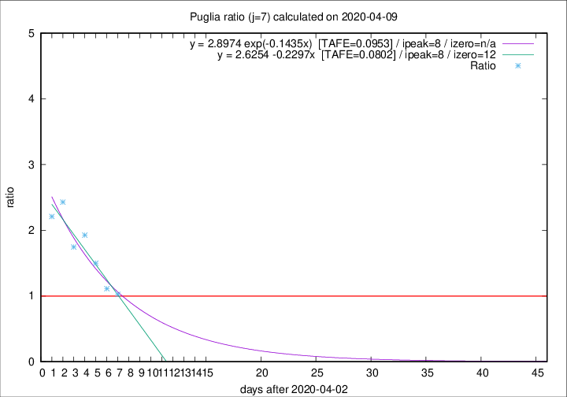

# Puglia

Data source: https://raw.githubusercontent.com/pcm-dpc/COVID-19/master/dati-json/dpc-covid19-ita-regioni.json

Estimates in this page were made on 12/4/2020 with data available until 09/04/2020.

## Summary 

### Peak estimate 
|j|linear [TAFE]|exponential [TAFE]|power law [TAFE]|details|
|---|----|-----------|---------|-------|
|7|11/4/2020 [TAFE=0.0802]|11/4/2020 [TAFE=0.0953]|15/4/2020 [TAFE=0.1466]|[analysis](COVID-19_puglia_j7_2020-04-09.md)|
|8|12/4/2020 [TAFE=0.0937]|13/4/2020 [TAFE=0.0988]|25/4/2020 [TAFE=0.1376]|[analysis](COVID-19_puglia_j8_2020-04-09.md)|
|9|13/4/2020 [TAFE=0.1210]|16/4/2020 [TAFE=0.1225]|7/6/2020 [TAFE=0.1427]|[analysis](COVID-19_puglia_j9_2020-04-09.md)|
|10|17/4/2020 [TAFE=0.0863]|22/4/2020 [TAFE=0.0876]|-|[analysis](COVID-19_puglia_j10_2020-04-09.md)|
|11|21/4/2020 [TAFE=0.1164]|30/4/2020 [TAFE=0.1211]|-|[analysis](COVID-19_puglia_j11_2020-04-09.md)|
|12|24/4/2020 [TAFE=0.1119]|6/5/2020 [TAFE=0.1173]|-|[analysis](COVID-19_puglia_j12_2020-04-09.md)|
|13|3/5/2020 [TAFE=0.1590]|18/5/2020 [TAFE=0.1665]|-|[analysis](COVID-19_puglia_j13_2020-04-09.md)|
|14|16/4/2020 [TAFE=0.1903]|30/4/2020 [TAFE=0.1883]|-|[analysis](COVID-19_puglia_j14_2020-04-09.md)|

Best estimator is linear with j=7 (TAFE=0.0802)
Corresponding peak date estimate is 11/4/2020 (ipeak 8)

Peak date range estimate: 3/4/2020 - 9/6/2020

### End estimate 
|j|linear [TAFE/TFE]|exponential [TAFE/TFE]|power law [TAFE/TFE]|details|
|---|----|-----------|---------|-------|
|7|15/4/2020 [TAFE=0.0802]|-|-|[analysis](COVID-19_puglia_j7_2020-04-09.md)|
|8|-|-|-|[analysis](COVID-19_puglia_j8_2020-04-09.md)|
|9|-|-|-|[analysis](COVID-19_puglia_j9_2020-04-09.md)|
|10|-|-|-|[analysis](COVID-19_puglia_j10_2020-04-09.md)|
|11|-|-|-|[analysis](COVID-19_puglia_j11_2020-04-09.md)|
|12|-|-|-|[analysis](COVID-19_puglia_j12_2020-04-09.md)|
|13|-|-|-|[analysis](COVID-19_puglia_j13_2020-04-09.md)|
|14|-|-|-|[analysis](COVID-19_puglia_j14_2020-04-09.md)|

Best estimator is linear with j=7 (TAFE=0.0802)
Corresponding end date estimate is 15/4/2020 (izero 12)

End date range estimate: 3/4/2020 - 18/5/2020

Generated April 12th, 2020 at 16:28:18 UTC+0200 with https://github.com/robianc/COVID-19
