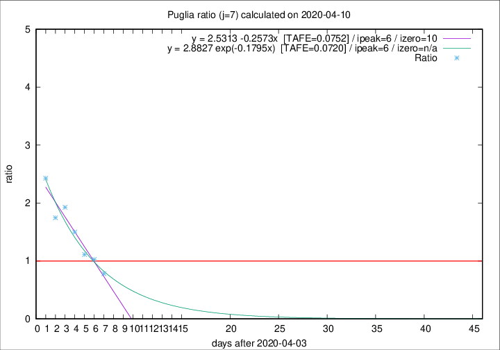

# Puglia

Data source: https://raw.githubusercontent.com/pcm-dpc/COVID-19/master/dati-json/dpc-covid19-ita-regioni.json

Estimates in this page were made on 10/4/2020 with data available until 10/04/2020.

## Summary 

### Peak estimate 
|j|linear [TAFE]|exponential [TAFE]|power law [TAFE]|details|
|---|----|-----------|---------|-------|
|7|10/4/2020 [TAFE=0.0752]|10/4/2020 [TAFE=0.0720]|11/4/2020 [TAFE=0.1144]|[analysis](COVID-19_puglia_j7_2020-04-10.md)|
|8|12/4/2020 [TAFE=0.0914]|12/4/2020 [TAFE=0.1135]|20/4/2020 [TAFE=0.1912]|[analysis](COVID-19_puglia_j8_2020-04-10.md)|
|9|12/4/2020 [TAFE=0.1044]|14/4/2020 [TAFE=0.1175]|27/4/2020 [TAFE=0.1532]|[analysis](COVID-19_puglia_j9_2020-04-10.md)|
|10|15/4/2020 [TAFE=0.0804]|18/4/2020 [TAFE=0.0881]|1/7/2020 [TAFE=0.1153]|[analysis](COVID-19_puglia_j10_2020-04-10.md)|
|11|17/4/2020 [TAFE=0.0816]|23/4/2020 [TAFE=0.0821]|-|[analysis](COVID-19_puglia_j11_2020-04-10.md)|
|12|20/4/2020 [TAFE=0.1076]|28/4/2020 [TAFE=0.1166]|-|[analysis](COVID-19_puglia_j12_2020-04-10.md)|
|13|23/4/2020 [TAFE=0.1283]|5/5/2020 [TAFE=0.1373]|-|[analysis](COVID-19_puglia_j13_2020-04-10.md)|
|14|21/4/2020 [TAFE=0.1587]|4/5/2020 [TAFE=0.1692]|-|[analysis](COVID-19_puglia_j14_2020-04-10.md)|

Best estimator is exp with j=7 (TAFE=0.0720)
Corresponding peak date estimate is 10/4/2020 (ipeak 6)

Peak date range estimate: 4/4/2020 - 4/7/2020

### End estimate 
|j|linear [TAFE/TFE]|exponential [TAFE/TFE]|power law [TAFE/TFE]|details|
|---|----|-----------|---------|-------|
|7|14/4/2020 [TAFE=0.0752]|-|-|[analysis](COVID-19_puglia_j7_2020-04-10.md)|
|8|-|-|-|[analysis](COVID-19_puglia_j8_2020-04-10.md)|
|9|-|-|-|[analysis](COVID-19_puglia_j9_2020-04-10.md)|
|10|-|-|-|[analysis](COVID-19_puglia_j10_2020-04-10.md)|
|11|-|-|-|[analysis](COVID-19_puglia_j11_2020-04-10.md)|
|12|-|-|-|[analysis](COVID-19_puglia_j12_2020-04-10.md)|
|13|-|-|-|[analysis](COVID-19_puglia_j13_2020-04-10.md)|
|14|-|-|-|[analysis](COVID-19_puglia_j14_2020-04-10.md)|

Best estimator is linear with j=7 (TAFE=0.0752)
Corresponding end date estimate is 14/4/2020 (izero 10)

End date range estimate: 4/4/2020 - 5/5/2020

Generated April 10th, 2020 at 17:26:10 UTC+0200 with https://github.com/robianc/COVID-19
