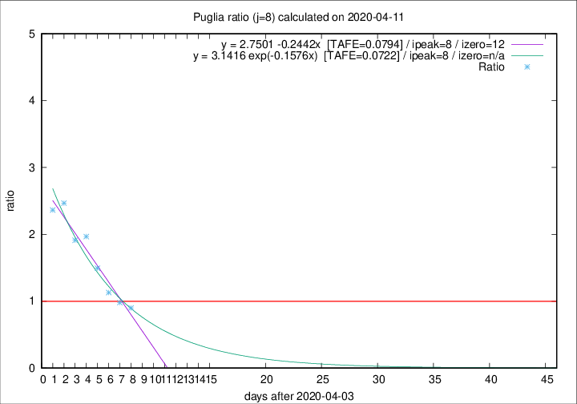

# Puglia

Data source: https://raw.githubusercontent.com/pcm-dpc/COVID-19/master/dati-json/dpc-covid19-ita-regioni.json

Estimates in this page were made on 12/4/2020 with data available until 11/04/2020.

## Summary 

### Peak estimate 
|j|linear [TAFE]|exponential [TAFE]|power law [TAFE]|details|
|---|----|-----------|---------|-------|
|7|11/4/2020 [TAFE=0.0958]|11/4/2020 [TAFE=0.0827]|10/4/2020 [TAFE=0.1240]|[analysis](COVID-19_puglia_j7_2020-04-11.md)|
|8|12/4/2020 [TAFE=0.0794]|12/4/2020 [TAFE=0.0722]|13/4/2020 [TAFE=0.1577]|[analysis](COVID-19_puglia_j8_2020-04-11.md)|
|9|13/4/2020 [TAFE=0.1129]|14/4/2020 [TAFE=0.1173]|20/4/2020 [TAFE=0.1496]|[analysis](COVID-19_puglia_j9_2020-04-11.md)|
|10|14/4/2020 [TAFE=0.0926]|16/4/2020 [TAFE=0.1123]|16/5/2020 [TAFE=0.1585]|[analysis](COVID-19_puglia_j10_2020-04-11.md)|
|11|16/4/2020 [TAFE=0.0755]|20/4/2020 [TAFE=0.0777]|-|[analysis](COVID-19_puglia_j11_2020-04-11.md)|
|12|18/4/2020 [TAFE=0.0855]|25/4/2020 [TAFE=0.0942]|-|[analysis](COVID-19_puglia_j12_2020-04-11.md)|
|13|20/4/2020 [TAFE=0.1201]|29/4/2020 [TAFE=0.1332]|-|[analysis](COVID-19_puglia_j13_2020-04-11.md)|
|14|24/4/2020 [TAFE=0.1485]|6/5/2020 [TAFE=0.1605]|-|[analysis](COVID-19_puglia_j14_2020-04-11.md)|

Best estimator is exp with j=8 (TAFE=0.0722)
Corresponding peak date estimate is 12/4/2020 (ipeak 8)

Peak date range estimate: 4/4/2020 - 18/5/2020

### End estimate 
|j|linear [TAFE/TFE]|exponential [TAFE/TFE]|power law [TAFE/TFE]|details|
|---|----|-----------|---------|-------|
|7|16/4/2020 [TAFE=0.0958]|-|-|[analysis](COVID-19_puglia_j7_2020-04-11.md)|
|8|16/4/2020 [TAFE=0.0794]|-|-|[analysis](COVID-19_puglia_j8_2020-04-11.md)|
|9|-|-|-|[analysis](COVID-19_puglia_j9_2020-04-11.md)|
|10|-|-|-|[analysis](COVID-19_puglia_j10_2020-04-11.md)|
|11|20/4/2020 [TAFE=0.0755]|-|-|[analysis](COVID-19_puglia_j11_2020-04-11.md)|
|12|-|-|-|[analysis](COVID-19_puglia_j12_2020-04-11.md)|
|13|-|-|-|[analysis](COVID-19_puglia_j13_2020-04-11.md)|
|14|-|-|-|[analysis](COVID-19_puglia_j14_2020-04-11.md)|

Best estimator is linear with j=11 (TAFE=0.0755)
Corresponding end date estimate is 20/4/2020 (izero 19)

End date range estimate: 1/4/2020 - 3/5/2020

Generated April 12th, 2020 at 17:02:01 UTC+0200 with https://github.com/robianc/COVID-19
