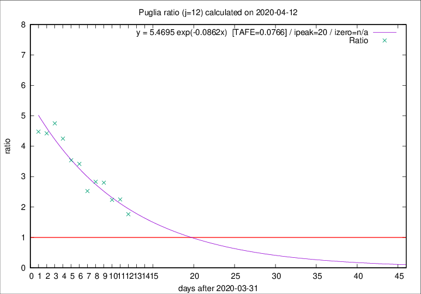

# Puglia

Data source: https://raw.githubusercontent.com/pcm-dpc/COVID-19/master/dati-json/dpc-covid19-ita-regioni.json

Delta days analysis (j): 12

Analyses for other values of j for 2020-04-12 are avalable [here](../2020-04-12/README.md)

Analyses for Puglia for previous dates are avalable [here](../README.md)

## Fitting 
|fit type|best fit equation|tafe|tfe|ipeak|izero|
|-------|-----|--------|------|---|---|
|exp|y = 5.4695 exp(-0.0862x)  [TAFE=0.0766]|0.0766|0.0042|20|n/a|

## Data
|Date|Daily deaths|Cumulated deaths|Deaths in the last 12 days|Deaths in the 12 days before|ratio|
|----|----------|-----------|-------|--------------------|-----|
|2020-04-12|7|260|150|85|1.7647|
|2020-04-11|15|253|162|72|2.2500|
|2020-04-10|13|238|152|68|2.2353|
|2020-04-09|6|225|154|55|2.8000|
|2020-04-08|10|219|150|53|2.8302|
|2020-04-07|14|209|144|57|2.5263|
|2020-04-06|13|195|147|43|3.4186|
|2020-04-05|9|182|138|39|3.5385|
|2020-04-04|9|173|136|32|4.2500|
|2020-04-03|20|164|133|28|4.7500|
|2020-04-02|15|144|115|26|4.4231|
|2020-04-01|19|129|103|23|4.4783|

[Download data as CSV](COVID-19_puglia_j12_2020-04-12.csv)

Generated April 14th, 2020 at 19:16:04 UTC+0200 with https://github.com/robianc/COVID-19
