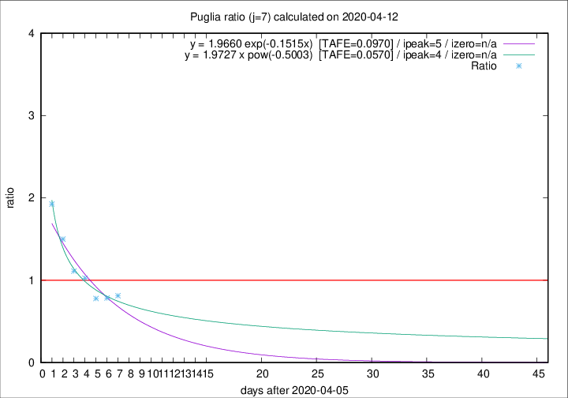

# Puglia

Data source: https://raw.githubusercontent.com/pcm-dpc/COVID-19/master/dati-json/dpc-covid19-ita-regioni.json

Delta days analysis (j): 7

Analyses for other values of j for 2020-04-12 are avalable [here](../2020-04-12/README.md)

Analyses for Puglia for previous dates are avalable [here](../README.md)

## Fitting 
|fit type|best fit equation|tafe|tfe|ipeak|izero|
|-------|-----|--------|------|---|---|
|exp|y = 1.9660 exp(-0.1515x)  [TAFE=0.0970]|0.0970|0.0065|5|n/a|
|pow|y = 1.9727 x pow(-0.5003)  [TAFE=0.0570]|0.0570|0.0023|4|n/a|

## Data
|Date|Daily deaths|Cumulated deaths|Deaths in the last 7 days|Deaths in the 7 days before|ratio|
|----|----------|-----------|-------|--------------------|-----|
|2020-04-12|7|260|78|96|0.8125|
|2020-04-11|15|253|80|102|0.7843|
|2020-04-10|13|238|74|95|0.7789|
|2020-04-09|6|225|81|79|1.0253|
|2020-04-08|10|219|90|81|1.1111|
|2020-04-07|14|209|99|66|1.5000|
|2020-04-06|13|195|104|54|1.9259|

[Download data as CSV](COVID-19_puglia_j7_2020-04-12.csv)

Generated April 14th, 2020 at 19:16:04 UTC+0200 with https://github.com/robianc/COVID-19
