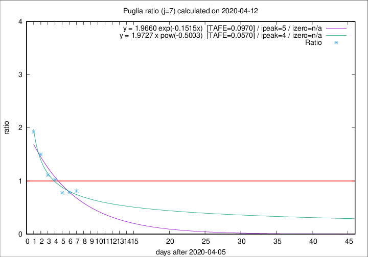

# Puglia

Data source: https://raw.githubusercontent.com/pcm-dpc/COVID-19/master/dati-json/dpc-covid19-ita-regioni.json

Estimates in this page were made on 12/4/2020 with data available until 12/04/2020.

## Summary 

### Peak estimate 
|j|linear [TAFE]|exponential [TAFE]|power law [TAFE]|details|
|---|----|-----------|---------|-------|
|7|11/4/2020 [TAFE=0.1339]|11/4/2020 [TAFE=0.0970]|10/4/2020 [TAFE=0.0570]|[analysis](COVID-19_puglia_j7_2020-04-12.md)|
|8|12/4/2020 [TAFE=0.1089]|12/4/2020 [TAFE=0.0631]|12/4/2020 [TAFE=0.0913]|[analysis](COVID-19_puglia_j8_2020-04-12.md)|
|9|13/4/2020 [TAFE=0.0985]|13/4/2020 [TAFE=0.1161]|17/4/2020 [TAFE=0.1991]|[analysis](COVID-19_puglia_j9_2020-04-12.md)|
|10|14/4/2020 [TAFE=0.0832]|15/4/2020 [TAFE=0.1133]|26/4/2020 [TAFE=0.1814]|[analysis](COVID-19_puglia_j10_2020-04-12.md)|
|11|15/4/2020 [TAFE=0.0688]|18/4/2020 [TAFE=0.0684]|18/5/2020 [TAFE=0.1239]|[analysis](COVID-19_puglia_j11_2020-04-12.md)|
|12|16/4/2020 [TAFE=0.0641]|21/4/2020 [TAFE=0.0766]|-|[analysis](COVID-19_puglia_j12_2020-04-12.md)|
|13|18/4/2020 [TAFE=0.0979]|25/4/2020 [TAFE=0.1092]|-|[analysis](COVID-19_puglia_j13_2020-04-12.md)|
|14|20/4/2020 [TAFE=0.1243]|29/4/2020 [TAFE=0.1389]|-|[analysis](COVID-19_puglia_j14_2020-04-12.md)|

Best estimator is pow with j=7 (TAFE=0.0570)
Corresponding peak date estimate is 10/4/2020 (ipeak 4)

Peak date range estimate: 6/4/2020 - 22/5/2020

### End estimate 
|j|linear [TAFE/TFE]|exponential [TAFE/TFE]|power law [TAFE/TFE]|details|
|---|----|-----------|---------|-------|
|7|17/4/2020 [TAFE=0.1339]|-|-|[analysis](COVID-19_puglia_j7_2020-04-12.md)|
|8|16/4/2020 [TAFE=0.1089]|-|-|[analysis](COVID-19_puglia_j8_2020-04-12.md)|
|9|18/4/2020 [TAFE=0.0985]|-|-|[analysis](COVID-19_puglia_j9_2020-04-12.md)|
|10|18/4/2020 [TAFE=0.0832]|-|-|[analysis](COVID-19_puglia_j10_2020-04-12.md)|
|11|19/4/2020 [TAFE=0.0688]|-|-|[analysis](COVID-19_puglia_j11_2020-04-12.md)|
|12|20/4/2020 [TAFE=0.0641]|-|-|[analysis](COVID-19_puglia_j12_2020-04-12.md)|
|13|-|-|-|[analysis](COVID-19_puglia_j13_2020-04-12.md)|
|14|-|-|-|[analysis](COVID-19_puglia_j14_2020-04-12.md)|

Best estimator is linear with j=12 (TAFE=0.0641)
Corresponding end date estimate is 20/4/2020 (izero 19)

End date range estimate: 1/4/2020 - 26/4/2020

Generated April 12th, 2020 at 17:02:01 UTC+0200 with https://github.com/robianc/COVID-19
