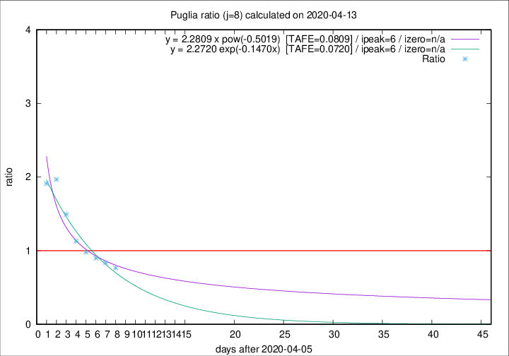

# Puglia

Data source: https://raw.githubusercontent.com/pcm-dpc/COVID-19/master/dati-json/dpc-covid19-ita-regioni.json

Delta days analysis (j): 8

Analyses for other values of j for 2020-04-13 are avalable [here](../2020-04-13/README.md)

Analyses for Puglia for previous dates are avalable [here](../README.md)

## Fitting 
|fit type|best fit equation|tafe|tfe|ipeak|izero|
|-------|-----|--------|------|---|---|
|exp|y = 2.2720 exp(-0.1470x)  [TAFE=0.0720]|0.0720|0.0035|6|n/a|
|pow|y = 2.2809 x pow(-0.5019)  [TAFE=0.0809]|0.0809|0.0057|6|n/a|

## Data
|Date|Daily deaths|Cumulated deaths|Deaths in the last 8 days|Deaths in the 8 days before|ratio|
|----|----------|-----------|-------|--------------------|-----|
|2020-04-13|7|267|85|111|0.7658|
|2020-04-12|7|260|87|104|0.8365|
|2020-04-11|15|253|89|99|0.8990|
|2020-04-10|13|238|94|96|0.9792|
|2020-04-09|6|225|96|85|1.1294|
|2020-04-08|10|219|109|73|1.4932|
|2020-04-07|14|209|118|60|1.9667|
|2020-04-06|13|195|109|57|1.9123|

[Download data as CSV](COVID-19_puglia_j8_2020-04-13.csv)

Generated April 16th, 2020 at 20:09:19 UTC+0200 with https://github.com/robianc/COVID-19
