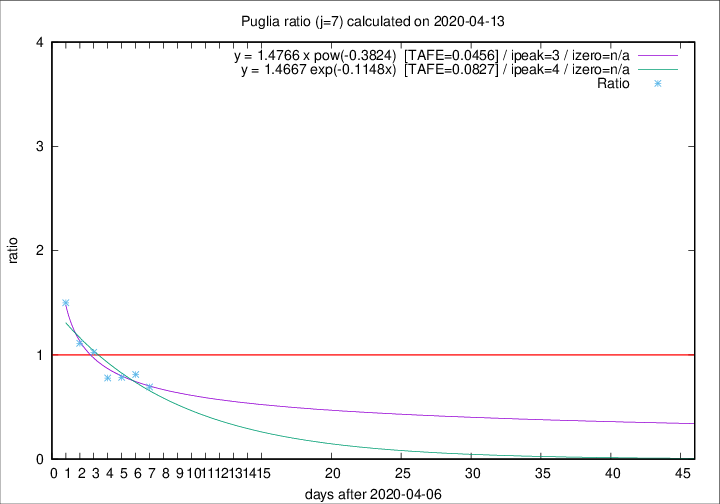
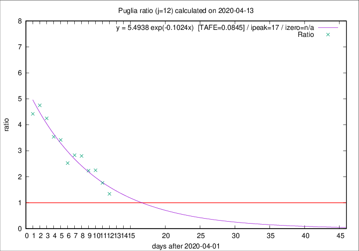

# Puglia

Data source: https://raw.githubusercontent.com/pcm-dpc/COVID-19/master/dati-json/dpc-covid19-ita-regioni.json

Estimates in this page were made on 19/4/2020 with data available until 13/04/2020.

## Summary 

### Peak estimate 
|j|linear [TAFE]|exponential [TAFE]|power law [TAFE]|details|
|---|----|-----------|---------|-------|
|7|11/4/2020 [TAFE=0.1113]|11/4/2020 [TAFE=0.0827]|10/4/2020 [TAFE=0.0456]|[analysis](COVID-19_puglia_j7_2020-04-13.md)|
|8|12/4/2020 [TAFE=0.1109]|12/4/2020 [TAFE=0.0720]|12/4/2020 [TAFE=0.0809]|[analysis](COVID-19_puglia_j8_2020-04-13.md)|
|9|13/4/2020 [TAFE=0.1145]|13/4/2020 [TAFE=0.0916]|14/4/2020 [TAFE=0.1697]|[analysis](COVID-19_puglia_j9_2020-04-13.md)|
|10|14/4/2020 [TAFE=0.0864]|14/4/2020 [TAFE=0.1065]|18/4/2020 [TAFE=0.1774]|[analysis](COVID-19_puglia_j10_2020-04-13.md)|
|11|15/4/2020 [TAFE=0.0697]|17/4/2020 [TAFE=0.0898]|3/5/2020 [TAFE=0.1648]|[analysis](COVID-19_puglia_j11_2020-04-13.md)|
|12|16/4/2020 [TAFE=0.0680]|19/4/2020 [TAFE=0.0845]|27/5/2020 [TAFE=0.1526]|[analysis](COVID-19_puglia_j12_2020-04-13.md)|
|13|18/4/2020 [TAFE=0.0979]|23/4/2020 [TAFE=0.1133]|-|[analysis](COVID-19_puglia_j13_2020-04-13.md)|
|14|19/4/2020 [TAFE=0.0955]|26/4/2020 [TAFE=0.1083]|-|[analysis](COVID-19_puglia_j14_2020-04-13.md)|

Best estimator is pow with j=7 (TAFE=0.0456)
Corresponding peak date estimate is 10/4/2020 (ipeak 3)

Peak date range estimate: 7/4/2020 - 1/6/2020

### End estimate 
|j|linear [TAFE/TFE]|exponential [TAFE/TFE]|power law [TAFE/TFE]|details|
|---|----|-----------|---------|-------|
|7|20/4/2020 [TAFE=0.1113]|-|-|[analysis](COVID-19_puglia_j7_2020-04-13.md)|
|8|18/4/2020 [TAFE=0.1109]|-|-|[analysis](COVID-19_puglia_j8_2020-04-13.md)|
|9|-|-|-|[analysis](COVID-19_puglia_j9_2020-04-13.md)|
|10|17/4/2020 [TAFE=0.0864]|-|-|[analysis](COVID-19_puglia_j10_2020-04-13.md)|
|11|19/4/2020 [TAFE=0.0697]|-|-|[analysis](COVID-19_puglia_j11_2020-04-13.md)|
|12|19/4/2020 [TAFE=0.0680]|-|-|[analysis](COVID-19_puglia_j12_2020-04-13.md)|
|13|-|-|-|[analysis](COVID-19_puglia_j13_2020-04-13.md)|
|14|-|-|-|[analysis](COVID-19_puglia_j14_2020-04-13.md)|

Best estimator is linear with j=12 (TAFE=0.0680)
Corresponding end date estimate is 19/4/2020 (izero 17)

End date range estimate: 2/4/2020 - 24/4/2020

Generated April 19th, 2020 at 18:42:39 UTC+0200 with https://github.com/robianc/COVID-19
