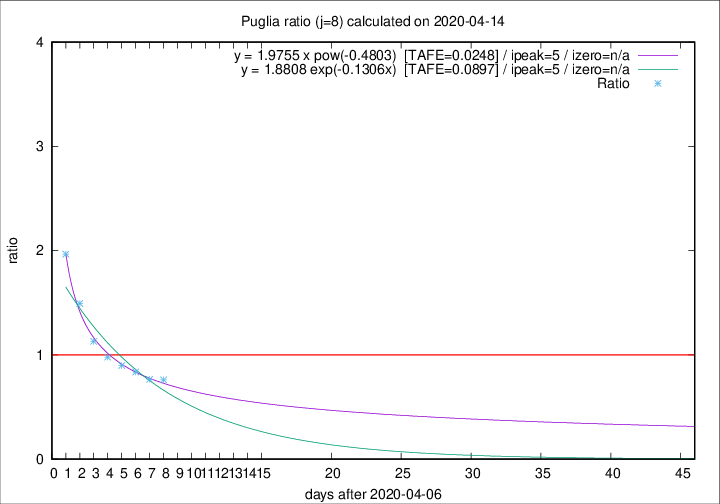
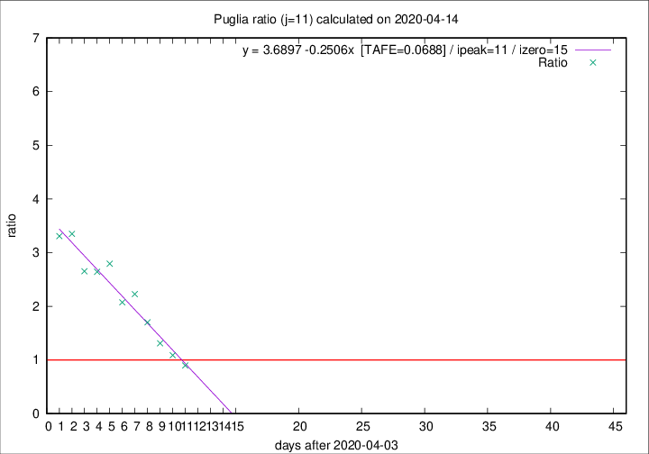

# Puglia

Data source: https://raw.githubusercontent.com/pcm-dpc/COVID-19/master/dati-json/dpc-covid19-ita-regioni.json

Estimates in this page were made on 19/4/2020 with data available until 14/04/2020.

## Summary 

### Peak estimate 
|j|linear [TAFE]|exponential [TAFE]|power law [TAFE]|details|
|---|----|-----------|---------|-------|
|7|10/4/2020 [TAFE=0.0712]|10/4/2020 [TAFE=0.0658]|10/4/2020 [TAFE=0.0464]|[analysis](COVID-19_puglia_j7_2020-04-14.md)|
|8|13/4/2020 [TAFE=0.1331]|12/4/2020 [TAFE=0.0897]|12/4/2020 [TAFE=0.0248]|[analysis](COVID-19_puglia_j8_2020-04-14.md)|
|9|13/4/2020 [TAFE=0.1597]|13/4/2020 [TAFE=0.0945]|13/4/2020 [TAFE=0.0756]|[analysis](COVID-19_puglia_j9_2020-04-14.md)|
|10|14/4/2020 [TAFE=0.0928]|14/4/2020 [TAFE=0.0996]|17/4/2020 [TAFE=0.2033]|[analysis](COVID-19_puglia_j10_2020-04-14.md)|
|11|15/4/2020 [TAFE=0.0688]|16/4/2020 [TAFE=0.1019]|24/4/2020 [TAFE=0.2033]|[analysis](COVID-19_puglia_j11_2020-04-14.md)|
|12|16/4/2020 [TAFE=0.0695]|18/4/2020 [TAFE=0.0838]|6/5/2020 [TAFE=0.1547]|[analysis](COVID-19_puglia_j12_2020-04-14.md)|
|13|17/4/2020 [TAFE=0.0761]|20/4/2020 [TAFE=0.0960]|3/6/2020 [TAFE=0.1674]|[analysis](COVID-19_puglia_j13_2020-04-14.md)|
|14|18/4/2020 [TAFE=0.0796]|24/4/2020 [TAFE=0.0950]|-|[analysis](COVID-19_puglia_j14_2020-04-14.md)|

Best estimator is pow with j=8 (TAFE=0.0248)
Corresponding peak date estimate is 12/4/2020 (ipeak 5)

Peak date range estimate: 7/4/2020 - 8/6/2020

### End estimate 
|j|linear [TAFE/TFE]|exponential [TAFE/TFE]|power law [TAFE/TFE]|details|
|---|----|-----------|---------|-------|
|7|25/4/2020 [TAFE=0.0712]|-|-|[analysis](COVID-19_puglia_j7_2020-04-14.md)|
|8|-|-|-|[analysis](COVID-19_puglia_j8_2020-04-14.md)|
|9|-|-|-|[analysis](COVID-19_puglia_j9_2020-04-14.md)|
|10|-|-|-|[analysis](COVID-19_puglia_j10_2020-04-14.md)|
|11|19/4/2020 [TAFE=0.0688]|-|-|[analysis](COVID-19_puglia_j11_2020-04-14.md)|
|12|-|-|-|[analysis](COVID-19_puglia_j12_2020-04-14.md)|
|13|-|-|-|[analysis](COVID-19_puglia_j13_2020-04-14.md)|
|14|-|-|-|[analysis](COVID-19_puglia_j14_2020-04-14.md)|

Best estimator is linear with j=11 (TAFE=0.0688)
Corresponding end date estimate is 19/4/2020 (izero 15)

End date range estimate: 4/4/2020 - 24/4/2020

Generated April 19th, 2020 at 18:42:39 UTC+0200 with https://github.com/robianc/COVID-19
