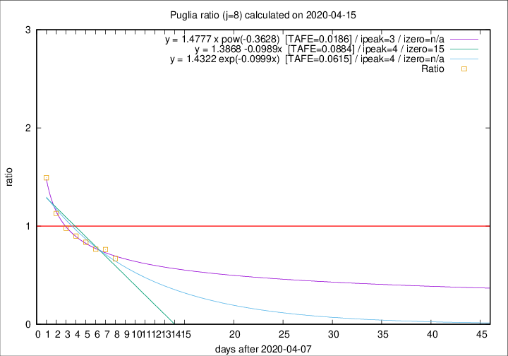

# Puglia

Data source: https://raw.githubusercontent.com/pcm-dpc/COVID-19/master/dati-json/dpc-covid19-ita-regioni.json

Delta days analysis (j): 8

Analyses for other values of j for 2020-04-15 are avalable [here](../2020-04-15/README.md)

Analyses for Puglia for previous dates are avalable [here](../README.md)

## Fitting 
|fit type|best fit equation|tafe|tfe|ipeak|izero|
|-------|-----|--------|------|---|---|
|linear|y = 1.3868 -0.0989x  [TAFE=0.0884]|0.0884|0.0044|4|15|
|exp|y = 1.4322 exp(-0.0999x)  [TAFE=0.0615]|0.0615|0.0027|4|n/a|
|pow|y = 1.4777 x pow(-0.3628)  [TAFE=0.0186]|0.0186|0.0003|3|n/a|

## Data
|Date|Daily deaths|Cumulated deaths|Deaths in the last 8 days|Deaths in the 8 days before|ratio|
|----|----------|-----------|-------|--------------------|-----|
|2020-04-15|10|288|79|118|0.6695|
|2020-04-14|11|278|83|109|0.7615|
|2020-04-13|7|267|85|111|0.7658|
|2020-04-12|7|260|87|104|0.8365|
|2020-04-11|15|253|89|99|0.8990|
|2020-04-10|13|238|94|96|0.9792|
|2020-04-09|6|225|96|85|1.1294|
|2020-04-08|10|219|109|73|1.4932|

[Download data as CSV](COVID-19_puglia_j8_2020-04-15.csv)

Generated April 19th, 2020 at 18:42:39 UTC+0200 with https://github.com/robianc/COVID-19
