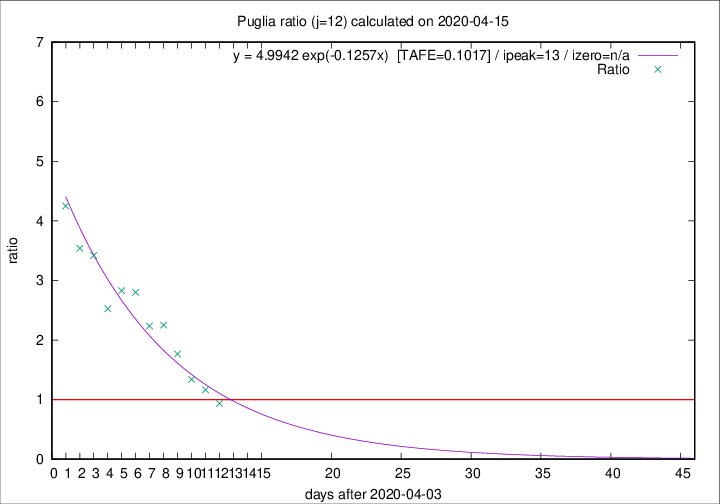

# Puglia

Data source: https://raw.githubusercontent.com/pcm-dpc/COVID-19/master/dati-json/dpc-covid19-ita-regioni.json

Estimates in this page were made on 19/4/2020 with data available until 15/04/2020.

## Summary 

### Peak estimate 
|j|linear [TAFE]|exponential [TAFE]|power law [TAFE]|details|
|---|----|-----------|---------|-------|
|7|11/4/2020 [TAFE=0.0784]|11/4/2020 [TAFE=0.0759]|11/4/2020 [TAFE=0.0617]|[analysis](COVID-19_puglia_j7_2020-04-15.md)|
|8|12/4/2020 [TAFE=0.0884]|12/4/2020 [TAFE=0.0615]|11/4/2020 [TAFE=0.0186]|[analysis](COVID-19_puglia_j8_2020-04-15.md)|
|9|14/4/2020 [TAFE=0.1510]|14/4/2020 [TAFE=0.0930]|13/4/2020 [TAFE=0.0773]|[analysis](COVID-19_puglia_j9_2020-04-15.md)|
|10|15/4/2020 [TAFE=0.1230]|15/4/2020 [TAFE=0.0929]|15/4/2020 [TAFE=0.1545]|[analysis](COVID-19_puglia_j10_2020-04-15.md)|
|11|15/4/2020 [TAFE=0.0919]|16/4/2020 [TAFE=0.0887]|19/4/2020 [TAFE=0.1992]|[analysis](COVID-19_puglia_j11_2020-04-15.md)|
|12|16/4/2020 [TAFE=0.0593]|17/4/2020 [TAFE=0.1017]|27/4/2020 [TAFE=0.1938]|[analysis](COVID-19_puglia_j12_2020-04-15.md)|
|13|17/4/2020 [TAFE=0.0801]|19/4/2020 [TAFE=0.0874]|11/5/2020 [TAFE=0.1718]|[analysis](COVID-19_puglia_j13_2020-04-15.md)|
|14|18/4/2020 [TAFE=0.0801]|22/4/2020 [TAFE=0.1074]|19/6/2020 [TAFE=0.1874]|[analysis](COVID-19_puglia_j14_2020-04-15.md)|

Best estimator is pow with j=8 (TAFE=0.0186)
Corresponding peak date estimate is 11/4/2020 (ipeak 3)

Peak date range estimate: 10/4/2020 - 25/6/2020

### End estimate 
|j|linear [TAFE/TFE]|exponential [TAFE/TFE]|power law [TAFE/TFE]|details|
|---|----|-----------|---------|-------|
|7|5/5/2020 [TAFE=0.0784]|-|-|[analysis](COVID-19_puglia_j7_2020-04-15.md)|
|8|-|-|-|[analysis](COVID-19_puglia_j8_2020-04-15.md)|
|9|-|-|-|[analysis](COVID-19_puglia_j9_2020-04-15.md)|
|10|-|-|-|[analysis](COVID-19_puglia_j10_2020-04-15.md)|
|11|-|-|-|[analysis](COVID-19_puglia_j11_2020-04-15.md)|
|12|20/4/2020 [TAFE=0.0593]|-|-|[analysis](COVID-19_puglia_j12_2020-04-15.md)|
|13|-|-|-|[analysis](COVID-19_puglia_j13_2020-04-15.md)|
|14|-|-|-|[analysis](COVID-19_puglia_j14_2020-04-15.md)|

Best estimator is linear with j=12 (TAFE=0.0593)
Corresponding end date estimate is 20/4/2020 (izero 16)

End date range estimate: 4/4/2020 - 30/4/2020

Generated April 19th, 2020 at 18:42:39 UTC+0200 with https://github.com/robianc/COVID-19
