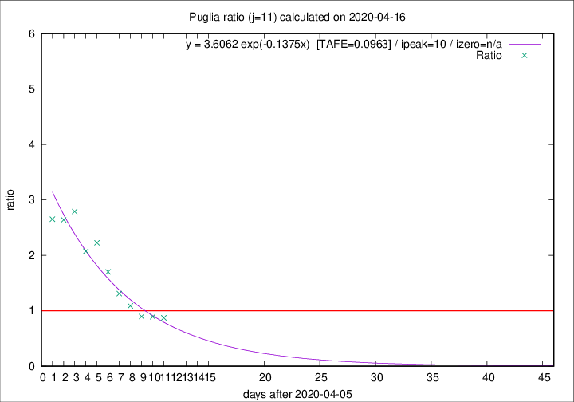

# Puglia

Data source: https://raw.githubusercontent.com/pcm-dpc/COVID-19/master/dati-json/dpc-covid19-ita-regioni.json

Delta days analysis (j): 11

Analyses for other values of j for 2020-04-16 are avalable [here](../2020-04-16/README.md)

Analyses for Puglia for previous dates are avalable [here](../README.md)

## Fitting 
|fit type|best fit equation|tafe|tfe|ipeak|izero|
|-------|-----|--------|------|---|---|
|exp|y = 3.6062 exp(-0.1375x)  [TAFE=0.0963]|0.0963|0.0068|10|n/a|

## Data
|Date|Daily deaths|Cumulated deaths|Deaths in the last 11 days|Deaths in the 11 days before|ratio|
|----|----------|-----------|-------|--------------------|-----|
|2020-04-16|11|299|117|134|0.8731|
|2020-04-15|10|288|115|129|0.8915|
|2020-04-14|11|278|114|127|0.8976|
|2020-04-13|7|267|123|113|1.0885|
|2020-04-12|7|260|131|100|1.3100|
|2020-04-11|15|253|143|84|1.7024|
|2020-04-10|13|238|147|66|2.2273|
|2020-04-09|6|225|139|67|2.0746|
|2020-04-08|10|219|148|53|2.7925|
|2020-04-07|14|209|140|53|2.6415|
|2020-04-06|13|195|130|49|2.6531|

[Download data as CSV](COVID-19_puglia_j11_2020-04-16.csv)

Generated April 19th, 2020 at 18:42:39 UTC+0200 with https://github.com/robianc/COVID-19
