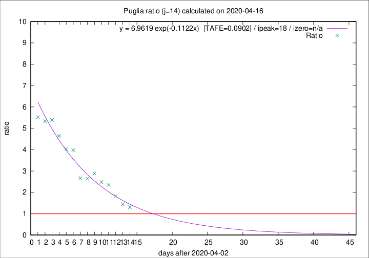

# Puglia

Data source: https://raw.githubusercontent.com/pcm-dpc/COVID-19/master/dati-json/dpc-covid19-ita-regioni.json

Delta days analysis (j): 14

Analyses for other values of j for 2020-04-16 are avalable [here](../2020-04-16/README.md)

Analyses for Puglia for previous dates are avalable [here](../README.md)

## Fitting 
|fit type|best fit equation|tafe|tfe|ipeak|izero|
|-------|-----|--------|------|---|---|
|exp|y = 6.9619 exp(-0.1122x)  [TAFE=0.0902]|0.0902|0.0050|18|n/a|

## Data
|Date|Daily deaths|Cumulated deaths|Deaths in the last 14 days|Deaths in the 14 days before|ratio|
|----|----------|-----------|-------|--------------------|-----|
|2020-04-16|11|299|155|119|1.3025|
|2020-04-15|10|288|159|110|1.4455|
|2020-04-14|11|278|168|92|1.8261|
|2020-04-13|7|267|176|75|2.3467|
|2020-04-12|7|260|174|70|2.4857|
|2020-04-11|15|253|182|63|2.8889|
|2020-04-10|13|238|169|64|2.6406|
|2020-04-09|6|225|160|60|2.6667|
|2020-04-08|10|219|171|43|3.9767|
|2020-04-07|14|209|165|41|4.0244|
|2020-04-06|13|195|158|34|4.6471|
|2020-04-05|9|182|151|28|5.3929|
|2020-04-04|9|173|144|27|5.3333|
|2020-04-03|20|164|138|25|5.5200|

[Download data as CSV](COVID-19_puglia_j14_2020-04-16.csv)

Generated April 16th, 2020 at 20:09:19 UTC+0200 with https://github.com/robianc/COVID-19
