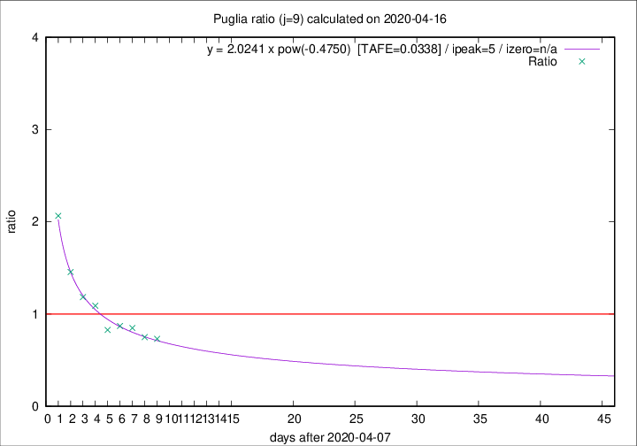

# Puglia

Data source: https://raw.githubusercontent.com/pcm-dpc/COVID-19/master/dati-json/dpc-covid19-ita-regioni.json

Delta days analysis (j): 9

Analyses for other values of j for 2020-04-16 are avalable [here](../2020-04-16/README.md)

Analyses for Puglia for previous dates are avalable [here](../README.md)

## Fitting 
|fit type|best fit equation|tafe|tfe|ipeak|izero|
|-------|-----|--------|------|---|---|
|pow|y = 2.0241 x pow(-0.4750)  [TAFE=0.0338]|0.0338|0.0013|5|n/a|

## Data
|Date|Daily deaths|Cumulated deaths|Deaths in the last 9 days|Deaths in the 9 days before|ratio|
|----|----------|-----------|-------|--------------------|-----|
|2020-04-16|11|299|90|123|0.7317|
|2020-04-15|10|288|93|124|0.7500|
|2020-04-14|11|278|96|113|0.8496|
|2020-04-13|7|267|94|108|0.8704|
|2020-04-12|7|260|96|116|0.8276|
|2020-04-11|15|253|109|100|1.0900|
|2020-04-10|13|238|109|92|1.1848|
|2020-04-09|6|225|115|79|1.4557|
|2020-04-08|10|219|128|62|2.0645|

[Download data as CSV](COVID-19_puglia_j9_2020-04-16.csv)

Generated April 16th, 2020 at 20:09:19 UTC+0200 with https://github.com/robianc/COVID-19
