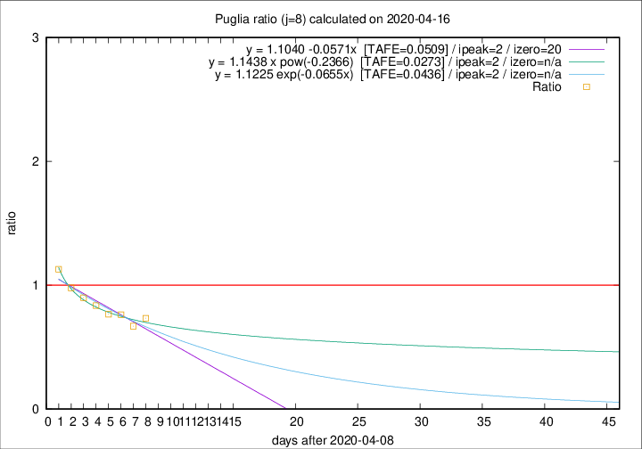

# Puglia

Data source: https://raw.githubusercontent.com/pcm-dpc/COVID-19/master/dati-json/dpc-covid19-ita-regioni.json

Estimates in this page were made on 16/4/2020 with data available until 16/04/2020.

## Summary 

### Peak estimate 
|j|linear [TAFE]|exponential [TAFE]|power law [TAFE]|details|
|---|----|-----------|---------|-------|
|7|12/4/2020 [TAFE=0.0758]|12/4/2020 [TAFE=0.0745]|12/4/2020 [TAFE=0.0696]|[analysis](COVID-19_puglia_j7_2020-04-16.md)|
|8|11/4/2020 [TAFE=0.0509]|11/4/2020 [TAFE=0.0436]|11/4/2020 [TAFE=0.0273]|[analysis](COVID-19_puglia_j8_2020-04-16.md)|
|9|14/4/2020 [TAFE=0.1497]|14/4/2020 [TAFE=0.0956]|13/4/2020 [TAFE=0.0338]|[analysis](COVID-19_puglia_j9_2020-04-16.md)|
|10|15/4/2020 [TAFE=0.1716]|15/4/2020 [TAFE=0.1047]|15/4/2020 [TAFE=0.0912]|[analysis](COVID-19_puglia_j10_2020-04-16.md)|
|11|16/4/2020 [TAFE=0.1166]|16/4/2020 [TAFE=0.0963]|18/4/2020 [TAFE=0.1865]|[analysis](COVID-19_puglia_j11_2020-04-16.md)|
|12|17/4/2020 [TAFE=0.0816]|17/4/2020 [TAFE=0.1012]|23/4/2020 [TAFE=0.2077]|[analysis](COVID-19_puglia_j12_2020-04-16.md)|
|13|17/4/2020 [TAFE=0.0837]|19/4/2020 [TAFE=0.0938]|1/5/2020 [TAFE=0.1820]|[analysis](COVID-19_puglia_j13_2020-04-16.md)|
|14|18/4/2020 [TAFE=0.0772]|21/4/2020 [TAFE=0.0902]|18/5/2020 [TAFE=0.1871]|[analysis](COVID-19_puglia_j14_2020-04-16.md)|

Best estimator is pow with j=8 (TAFE=0.0273)
Corresponding peak date estimate is 11/4/2020 (ipeak 2)

Peak date range estimate: 11/4/2020 - 24/5/2020

### End estimate 
|j|linear [TAFE/TFE]|exponential [TAFE/TFE]|power law [TAFE/TFE]|details|
|---|----|-----------|---------|-------|
|7|-|-|-|[analysis](COVID-19_puglia_j7_2020-04-16.md)|
|8|29/4/2020 [TAFE=0.0509]|-|-|[analysis](COVID-19_puglia_j8_2020-04-16.md)|
|9|-|-|-|[analysis](COVID-19_puglia_j9_2020-04-16.md)|
|10|-|-|-|[analysis](COVID-19_puglia_j10_2020-04-16.md)|
|11|-|-|-|[analysis](COVID-19_puglia_j11_2020-04-16.md)|
|12|-|-|-|[analysis](COVID-19_puglia_j12_2020-04-16.md)|
|13|-|-|-|[analysis](COVID-19_puglia_j13_2020-04-16.md)|
|14|-|-|-|[analysis](COVID-19_puglia_j14_2020-04-16.md)|

Best estimator is linear with j=8 (TAFE=0.0509)
Corresponding end date estimate is 29/4/2020 (izero 20)

End date range estimate: 9/4/2020 - 29/4/2020

Generated April 16th, 2020 at 20:09:19 UTC+0200 with https://github.com/robianc/COVID-19
