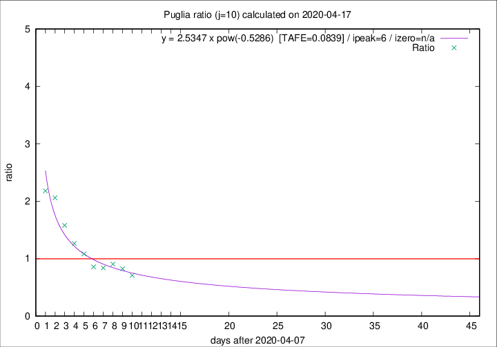

# Puglia

Data source: https://raw.githubusercontent.com/pcm-dpc/COVID-19/master/dati-json/dpc-covid19-ita-regioni.json

Delta days analysis (j): 10

Analyses for other values of j for 2020-04-17 are avalable [here](../2020-04-17/README.md)

Analyses for Puglia for previous dates are avalable [here](../README.md)

## Fitting 
|fit type|best fit equation|tafe|tfe|ipeak|izero|
|-------|-----|--------|------|---|---|
|pow|y = 2.5347 x pow(-0.5286)  [TAFE=0.0839]|0.0839|0.0048|6|n/a|

## Data
|Date|Daily deaths|Cumulated deaths|Deaths in the last 10 days|Deaths in the 10 days before|ratio|
|----|----------|-----------|-------|--------------------|-----|
|2020-04-17|8|307|98|138|0.7101|
|2020-04-16|11|299|104|126|0.8254|
|2020-04-15|10|288|106|117|0.9060|
|2020-04-14|11|278|105|125|0.8400|
|2020-04-13|7|267|103|120|0.8583|
|2020-04-12|7|260|116|107|1.0841|
|2020-04-11|15|253|124|98|1.2653|
|2020-04-10|13|238|128|81|1.5802|
|2020-04-09|6|225|134|65|2.0615|
|2020-04-08|10|219|133|61|2.1803|

[Download data as CSV](COVID-19_puglia_j10_2020-04-17.csv)

Generated April 19th, 2020 at 18:42:39 UTC+0200 with https://github.com/robianc/COVID-19
