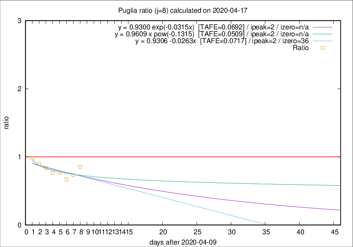

# Puglia

Data source: https://raw.githubusercontent.com/pcm-dpc/COVID-19/master/dati-json/dpc-covid19-ita-regioni.json

Delta days analysis (j): 8

Analyses for other values of j for 2020-04-17 are avalable [here](../2020-04-17/README.md)

Analyses for Puglia for previous dates are avalable [here](../README.md)

## Fitting 
|fit type|best fit equation|tafe|tfe|ipeak|izero|
|-------|-----|--------|------|---|---|
|linear|y = 0.9306 -0.0263x  [TAFE=0.0717]|0.0717|0.0075|2|36|
|exp|y = 0.9300 exp(-0.0315x)  [TAFE=0.0692]|0.0692|0.0037|2|n/a|
|pow|y = 0.9609 x pow(-0.1315)  [TAFE=0.0509]|0.0509|0.0027|2|n/a|

## Data
|Date|Daily deaths|Cumulated deaths|Deaths in the last 8 days|Deaths in the 8 days before|ratio|
|----|----------|-----------|-------|--------------------|-----|
|2020-04-17|8|307|82|96|0.8542|
|2020-04-16|11|299|80|109|0.7339|
|2020-04-15|10|288|79|118|0.6695|
|2020-04-14|11|278|83|109|0.7615|
|2020-04-13|7|267|85|111|0.7658|
|2020-04-12|7|260|87|104|0.8365|
|2020-04-11|15|253|89|99|0.8990|
|2020-04-10|13|238|94|96|0.9792|

[Download data as CSV](COVID-19_puglia_j8_2020-04-17.csv)

Generated April 19th, 2020 at 18:42:39 UTC+0200 with https://github.com/robianc/COVID-19
