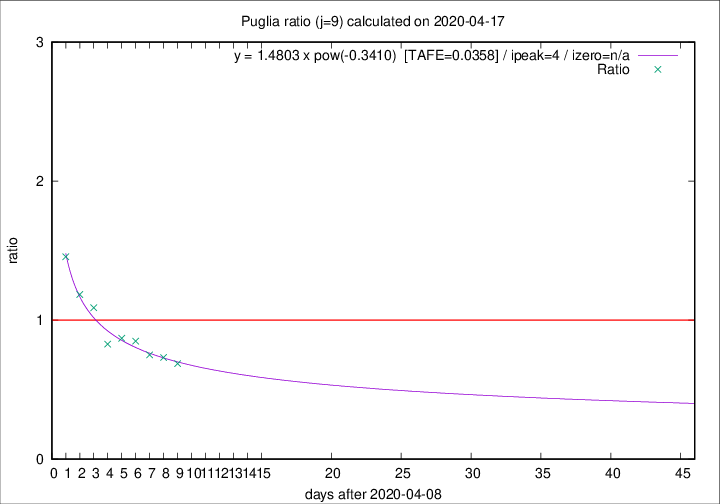
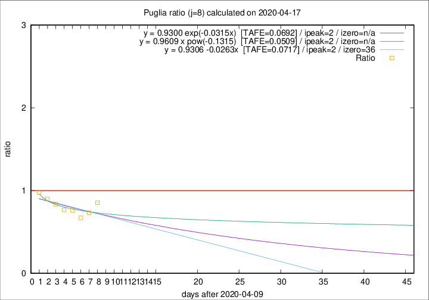

# Puglia

Data source: https://raw.githubusercontent.com/pcm-dpc/COVID-19/master/dati-json/dpc-covid19-ita-regioni.json

Estimates in this page were made on 19/4/2020 with data available until 17/04/2020.

## Summary 

### Peak estimate 
|j|linear [TAFE]|exponential [TAFE]|power law [TAFE]|details|
|---|----|-----------|---------|-------|
|7|13/4/2020 [TAFE=0.0897]|13/4/2020 [TAFE=0.0884]|13/4/2020 [TAFE=0.0966]|[analysis](COVID-19_puglia_j7_2020-04-17.md)|
|8|12/4/2020 [TAFE=0.0717]|12/4/2020 [TAFE=0.0692]|12/4/2020 [TAFE=0.0509]|[analysis](COVID-19_puglia_j8_2020-04-17.md)|
|9|14/4/2020 [TAFE=0.0761]|13/4/2020 [TAFE=0.0568]|13/4/2020 [TAFE=0.0358]|[analysis](COVID-19_puglia_j9_2020-04-17.md)|
|10|15/4/2020 [TAFE=0.1734]|15/4/2020 [TAFE=0.1091]|14/4/2020 [TAFE=0.0839]|[analysis](COVID-19_puglia_j10_2020-04-17.md)|
|11|16/4/2020 [TAFE=0.1563]|16/4/2020 [TAFE=0.1039]|17/4/2020 [TAFE=0.1424]|[analysis](COVID-19_puglia_j11_2020-04-17.md)|
|12|17/4/2020 [TAFE=0.1143]|17/4/2020 [TAFE=0.0985]|20/4/2020 [TAFE=0.2022]|[analysis](COVID-19_puglia_j12_2020-04-17.md)|
|13|18/4/2020 [TAFE=0.0926]|18/4/2020 [TAFE=0.0966]|26/4/2020 [TAFE=0.1962]|[analysis](COVID-19_puglia_j13_2020-04-17.md)|
|14|18/4/2020 [TAFE=0.0868]|20/4/2020 [TAFE=0.0887]|5/5/2020 [TAFE=0.1949]|[analysis](COVID-19_puglia_j14_2020-04-17.md)|

Best estimator is pow with j=9 (TAFE=0.0358)
Corresponding peak date estimate is 13/4/2020 (ipeak 4)

Peak date range estimate: 11/4/2020 - 10/5/2020

### End estimate 
|j|linear [TAFE/TFE]|exponential [TAFE/TFE]|power law [TAFE/TFE]|details|
|---|----|-----------|---------|-------|
|7|-|-|-|[analysis](COVID-19_puglia_j7_2020-04-17.md)|
|8|16/5/2020 [TAFE=0.0717]|-|-|[analysis](COVID-19_puglia_j8_2020-04-17.md)|
|9|-|-|-|[analysis](COVID-19_puglia_j9_2020-04-17.md)|
|10|-|-|-|[analysis](COVID-19_puglia_j10_2020-04-17.md)|
|11|-|-|-|[analysis](COVID-19_puglia_j11_2020-04-17.md)|
|12|-|-|-|[analysis](COVID-19_puglia_j12_2020-04-17.md)|
|13|-|-|-|[analysis](COVID-19_puglia_j13_2020-04-17.md)|
|14|-|-|-|[analysis](COVID-19_puglia_j14_2020-04-17.md)|

Best estimator is linear with j=8 (TAFE=0.0717)
Corresponding end date estimate is 16/5/2020 (izero 36)

End date range estimate: 10/4/2020 - 16/5/2020

Generated April 19th, 2020 at 18:42:39 UTC+0200 with https://github.com/robianc/COVID-19
