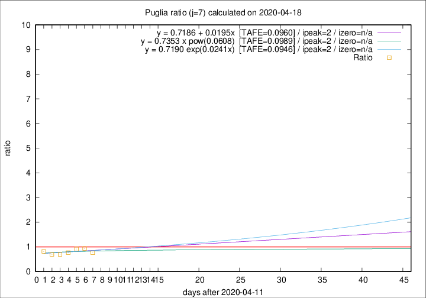

# Puglia

Data source: https://raw.githubusercontent.com/pcm-dpc/COVID-19/master/dati-json/dpc-covid19-ita-regioni.json

Delta days analysis (j): 7

Analyses for other values of j for 2020-04-18 are avalable [here](../2020-04-18/README.md)

Analyses for Puglia for previous dates are avalable [here](../README.md)

## Fitting 
|fit type|best fit equation|tafe|tfe|ipeak|izero|
|-------|-----|--------|------|---|---|
|linear|y = 0.7186 + 0.0195x  [TAFE=0.0960]|0.0960|0.0097|2|n/a|
|exp|y = 0.7190 exp(0.0241x)  [TAFE=0.0946]|0.0946|0.0047|2|n/a|
|pow|y = 0.7353 x pow(0.0608)  [TAFE=0.0989]|0.0989|0.0052|2|n/a|

## Data
|Date|Daily deaths|Cumulated deaths|Deaths in the last 7 days|Deaths in the 7 days before|ratio|
|----|----------|-----------|-------|--------------------|-----|
|2020-04-18|7|314|61|80|0.7625|
|2020-04-17|8|307|69|74|0.9324|
|2020-04-16|11|299|74|81|0.9136|
|2020-04-15|10|288|69|90|0.7667|
|2020-04-14|11|278|69|99|0.6970|
|2020-04-13|7|267|72|104|0.6923|
|2020-04-12|7|260|78|96|0.8125|

[Download data as CSV](COVID-19_puglia_j7_2020-04-18.csv)

Generated April 19th, 2020 at 18:42:39 UTC+0200 with https://github.com/robianc/COVID-19
