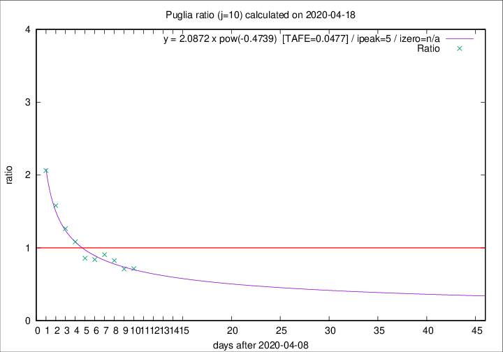

# Puglia

Data source: https://raw.githubusercontent.com/pcm-dpc/COVID-19/master/dati-json/dpc-covid19-ita-regioni.json

Estimates in this page were made on 19/4/2020 with data available until 18/04/2020.

## Summary 

### Peak estimate 
|j|linear [TAFE]|exponential [TAFE]|power law [TAFE]|details|
|---|----|-----------|---------|-------|
|7|14/4/2020 [TAFE=0.0960]|14/4/2020 [TAFE=0.0946]|14/4/2020 [TAFE=0.0989]|[analysis](COVID-19_puglia_j7_2020-04-18.md)|
|8|13/4/2020 [TAFE=0.0754]|13/4/2020 [TAFE=0.0749]|13/4/2020 [TAFE=0.0655]|[analysis](COVID-19_puglia_j8_2020-04-18.md)|
|9|13/4/2020 [TAFE=0.0770]|13/4/2020 [TAFE=0.0696]|13/4/2020 [TAFE=0.0503]|[analysis](COVID-19_puglia_j9_2020-04-18.md)|
|10|16/4/2020 [TAFE=0.1532]|15/4/2020 [TAFE=0.1058]|14/4/2020 [TAFE=0.0477]|[analysis](COVID-19_puglia_j10_2020-04-18.md)|
|11|17/4/2020 [TAFE=0.1902]|16/4/2020 [TAFE=0.1113]|16/4/2020 [TAFE=0.0909]|[analysis](COVID-19_puglia_j11_2020-04-18.md)|
|12|17/4/2020 [TAFE=0.1362]|17/4/2020 [TAFE=0.1018]|19/4/2020 [TAFE=0.1928]|[analysis](COVID-19_puglia_j12_2020-04-18.md)|
|13|18/4/2020 [TAFE=0.1223]|18/4/2020 [TAFE=0.0950]|23/4/2020 [TAFE=0.1911]|[analysis](COVID-19_puglia_j13_2020-04-18.md)|
|14|18/4/2020 [TAFE=0.1032]|20/4/2020 [TAFE=0.0824]|28/4/2020 [TAFE=0.1898]|[analysis](COVID-19_puglia_j14_2020-04-18.md)|

Best estimator is pow with j=10 (TAFE=0.0477)
Corresponding peak date estimate is 14/4/2020 (ipeak 5)

Peak date range estimate: 11/4/2020 - 2/5/2020

### End estimate 
|j|linear [TAFE/TFE]|exponential [TAFE/TFE]|power law [TAFE/TFE]|details|
|---|----|-----------|---------|-------|
|7|-|-|-|[analysis](COVID-19_puglia_j7_2020-04-18.md)|
|8|16/7/2020 [TAFE=0.0754]|-|-|[analysis](COVID-19_puglia_j8_2020-04-18.md)|
|9|-|-|-|[analysis](COVID-19_puglia_j9_2020-04-18.md)|
|10|-|-|-|[analysis](COVID-19_puglia_j10_2020-04-18.md)|
|11|-|-|-|[analysis](COVID-19_puglia_j11_2020-04-18.md)|
|12|-|-|-|[analysis](COVID-19_puglia_j12_2020-04-18.md)|
|13|-|-|-|[analysis](COVID-19_puglia_j13_2020-04-18.md)|
|14|-|-|-|[analysis](COVID-19_puglia_j14_2020-04-18.md)|

Best estimator is linear with j=8 (TAFE=0.0754)
Corresponding end date estimate is 16/7/2020 (izero 96)

End date range estimate: 11/4/2020 - 16/7/2020

Generated April 19th, 2020 at 18:42:39 UTC+0200 with https://github.com/robianc/COVID-19
