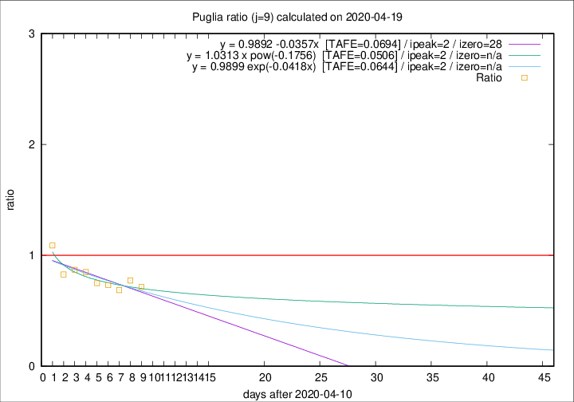

# Puglia

Data source: https://raw.githubusercontent.com/pcm-dpc/COVID-19/master/dati-json/dpc-covid19-ita-regioni.json

Delta days analysis (j): 9

Analyses for other values of j for 2020-04-19 are avalable [here](../2020-04-19/README.md)

Analyses for Puglia for previous dates are avalable [here](../README.md)

## Fitting 
|fit type|best fit equation|tafe|tfe|ipeak|izero|
|-------|-----|--------|------|---|---|
|linear|y = 0.9892 -0.0357x  [TAFE=0.0694]|0.0694|0.0057|2|28|
|exp|y = 0.9899 exp(-0.0418x)  [TAFE=0.0644]|0.0644|0.0026|2|n/a|
|pow|y = 1.0313 x pow(-0.1756)  [TAFE=0.0506]|0.0506|0.0016|2|n/a|

## Data
|Date|Daily deaths|Cumulated deaths|Deaths in the last 9 days|Deaths in the 9 days before|ratio|
|----|----------|-----------|-------|--------------------|-----|
|2020-04-19|2|316|78|109|0.7156|
|2020-04-18|7|314|89|115|0.7739|
|2020-04-17|8|307|88|128|0.6875|
|2020-04-16|11|299|90|123|0.7317|
|2020-04-15|10|288|93|124|0.7500|
|2020-04-14|11|278|96|113|0.8496|
|2020-04-13|7|267|94|108|0.8704|
|2020-04-12|7|260|96|116|0.8276|
|2020-04-11|15|253|109|100|1.0900|

[Download data as CSV](COVID-19_puglia_j9_2020-04-19.csv)

Generated April 19th, 2020 at 18:42:39 UTC+0200 with https://github.com/robianc/COVID-19
