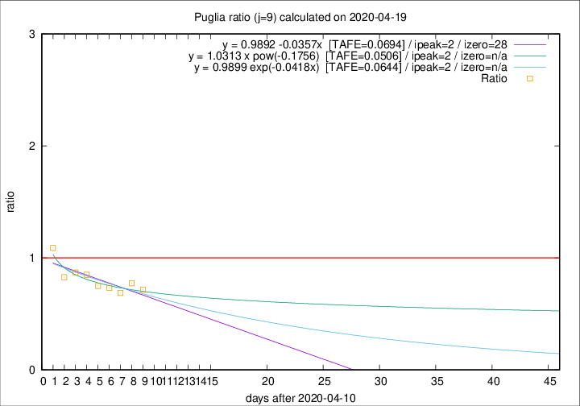

# Puglia

Data source: https://raw.githubusercontent.com/pcm-dpc/COVID-19/master/dati-json/dpc-covid19-ita-regioni.json

Estimates in this page were made on 19/4/2020 with data available until 19/04/2020.

## Summary 

### Peak estimate 
|j|linear [TAFE]|exponential [TAFE]|power law [TAFE]|details|
|---|----|-----------|---------|-------|
|7|15/4/2020 [TAFE=0.0942]|15/4/2020 [TAFE=0.0921]|15/4/2020 [TAFE=0.0838]|[analysis](COVID-19_puglia_j7_2020-04-19.md)|
|8|14/4/2020 [TAFE=0.0656]|14/4/2020 [TAFE=0.0646]|14/4/2020 [TAFE=0.0619]|[analysis](COVID-19_puglia_j8_2020-04-19.md)|
|9|13/4/2020 [TAFE=0.0694]|13/4/2020 [TAFE=0.0644]|13/4/2020 [TAFE=0.0506]|[analysis](COVID-19_puglia_j9_2020-04-19.md)|
|10|15/4/2020 [TAFE=0.0970]|15/4/2020 [TAFE=0.0792]|14/4/2020 [TAFE=0.0416]|[analysis](COVID-19_puglia_j10_2020-04-19.md)|
|11|17/4/2020 [TAFE=0.1690]|16/4/2020 [TAFE=0.1008]|16/4/2020 [TAFE=0.0923]|[analysis](COVID-19_puglia_j11_2020-04-19.md)|
|12|18/4/2020 [TAFE=0.1680]|17/4/2020 [TAFE=0.0854]|17/4/2020 [TAFE=0.1300]|[analysis](COVID-19_puglia_j12_2020-04-19.md)|
|13|18/4/2020 [TAFE=0.1437]|19/4/2020 [TAFE=0.0933]|21/4/2020 [TAFE=0.1890]|[analysis](COVID-19_puglia_j13_2020-04-19.md)|
|14|19/4/2020 [TAFE=0.1158]|20/4/2020 [TAFE=0.0825]|25/4/2020 [TAFE=0.1962]|[analysis](COVID-19_puglia_j14_2020-04-19.md)|

Best estimator is pow with j=10 (TAFE=0.0416)
Corresponding peak date estimate is 14/4/2020 (ipeak 4)

Peak date range estimate: 12/4/2020 - 29/4/2020

### End estimate 
|j|linear [TAFE/TFE]|exponential [TAFE/TFE]|power law [TAFE/TFE]|details|
|---|----|-----------|---------|-------|
|7|-|-|-|[analysis](COVID-19_puglia_j7_2020-04-19.md)|
|8|-|-|-|[analysis](COVID-19_puglia_j8_2020-04-19.md)|
|9|9/5/2020 [TAFE=0.0694]|-|-|[analysis](COVID-19_puglia_j9_2020-04-19.md)|
|10|-|-|-|[analysis](COVID-19_puglia_j10_2020-04-19.md)|
|11|-|-|-|[analysis](COVID-19_puglia_j11_2020-04-19.md)|
|12|-|-|-|[analysis](COVID-19_puglia_j12_2020-04-19.md)|
|13|-|-|-|[analysis](COVID-19_puglia_j13_2020-04-19.md)|
|14|-|-|-|[analysis](COVID-19_puglia_j14_2020-04-19.md)|

Best estimator is linear with j=9 (TAFE=0.0694)
Corresponding end date estimate is 9/5/2020 (izero 28)

End date range estimate: 11/4/2020 - 9/5/2020

Generated April 19th, 2020 at 18:42:39 UTC+0200 with https://github.com/robianc/COVID-19
