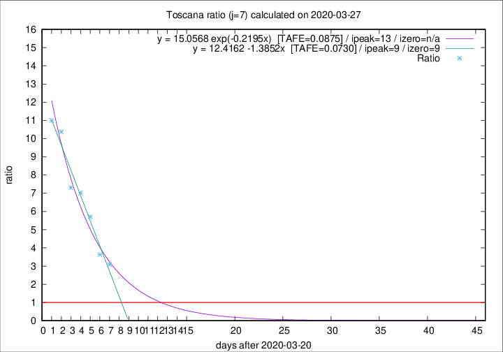

# Toscana

Data source: https://raw.githubusercontent.com/pcm-dpc/COVID-19/master/dati-json/dpc-covid19-ita-regioni.json

Delta days analysis (j): 7

Analyses for other values of j for 2020-03-27 are avalable [here](../README.md)

Analyses for Toscana for previous dates are avalable [here](../../README.md)

## Fitting 
|fit type|best fit equation|tafe|tfe|ipeak|izero|
|-------|-----|--------|------|---|---|
|linear|y = 12.4162 -1.3852x  [TAFE=0.0730]|0.0730|0.0019|9|9|
|exp|y = 15.0568 exp(-0.2195x)  [TAFE=0.0875]|0.0875|0.0043|13|n/a|

## Data
|Date|Daily deaths|Cumulated deaths|Deaths in the last 7 days|Deaths in the 7 days before|ratio|
|----|----------|-----------|-------|--------------------|-----|
|2020-03-27|19|177|130|42|3.0952|
|2020-03-26|16|158|120|33|3.6364|
|2020-03-25|13|142|120|21|5.7143|
|2020-03-24|20|129|112|16|7.0000|
|2020-03-23|18|109|95|13|7.3077|
|2020-03-22|19|91|83|8|10.3750|
|2020-03-21|25|72|66|6|11.0000|

[Download data as CSV](COVID-19_toscana_j7_2020-03-27.csv)

Generated April 12th, 2020 at 16:28:18 UTC+0200 with https://github.com/robianc/COVID-19
