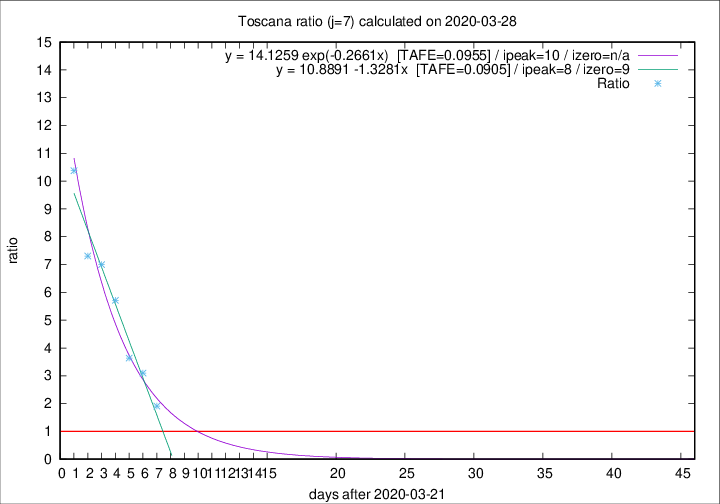

# Toscana

Data source: https://raw.githubusercontent.com/pcm-dpc/COVID-19/master/dati-json/dpc-covid19-ita-regioni.json

Estimates in this page were made on 14/4/2020 with data available until 28/03/2020.

## Summary 

### Peak estimate 
|j|linear [TAFE]|exponential [TAFE]|power law [TAFE]|details|
|---|----|-----------|---------|-------|
|7|30/3/2020 [TAFE=0.0905]|1/4/2020 [TAFE=0.0955]|17/4/2020 [TAFE=0.1679]|[analysis](COVID-19_toscana_j7_2020-03-28.md)|
|8|31/3/2020 [TAFE=0.1133]|5/4/2020 [TAFE=0.1210]|10/6/2020 [TAFE=0.2394]|[analysis](COVID-19_toscana_j8_2020-03-28.md)|
|9|30/3/2020 [TAFE=0.3387]|6/4/2020 [TAFE=0.2209]|11/6/2020 [TAFE=0.2233]|[analysis](COVID-19_toscana_j9_2020-03-28.md)|
|10|30/3/2020 [TAFE=0.3330]|8/4/2020 [TAFE=0.2141]|-|[analysis](COVID-19_toscana_j10_2020-03-28.md)|
|11|-|-|-||
|12|-|-|-||
|13|-|-|-||
|14|-|-|-||

Best estimator is linear with j=7 (TAFE=0.0905)
Corresponding peak date estimate is 30/3/2020 (ipeak 8)

Peak date range estimate: 22/3/2020 - 13/6/2020

### End estimate 
|j|linear [TAFE/TFE]|exponential [TAFE/TFE]|power law [TAFE/TFE]|details|
|---|----|-----------|---------|-------|
|7|31/3/2020 [TAFE=0.0905]|-|-|[analysis](COVID-19_toscana_j7_2020-03-28.md)|
|8|-|-|-|[analysis](COVID-19_toscana_j8_2020-03-28.md)|
|9|-|-|-|[analysis](COVID-19_toscana_j9_2020-03-28.md)|
|10|-|-|-|[analysis](COVID-19_toscana_j10_2020-03-28.md)|
|11|-|-|-||
|12|-|-|-||
|13|-|-|-||
|14|-|-|-||

Best estimator is linear with j=7 (TAFE=0.0905)
Corresponding end date estimate is 31/3/2020 (izero 9)

End date range estimate: 22/3/2020 - 2/4/2020

Generated April 14th, 2020 at 19:16:04 UTC+0200 with https://github.com/robianc/COVID-19
