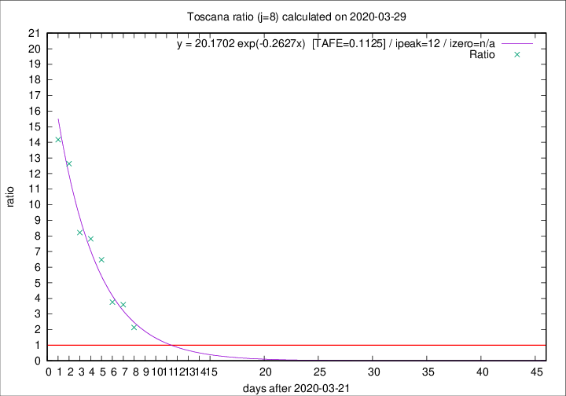

# Toscana

Data source: https://raw.githubusercontent.com/pcm-dpc/COVID-19/master/dati-json/dpc-covid19-ita-regioni.json

Delta days analysis (j): 8

Analyses for other values of j for 2020-03-29 are avalable [here](../README.md)

Analyses for Toscana for previous dates are avalable [here](../../README.md)

## Fitting 
|fit type|best fit equation|tafe|tfe|ipeak|izero|
|-------|-----|--------|------|---|---|
|exp|y = 20.1702 exp(-0.2627x)  [TAFE=0.1125]|0.1125|0.0067|12|n/a|

## Data
|Date|Daily deaths|Cumulated deaths|Deaths in the last 8 days|Deaths in the 8 days before|ratio|
|----|----------|-----------|-------|--------------------|-----|
|2020-03-29|17|215|143|67|2.1343|
|2020-03-28|21|198|151|42|3.5952|
|2020-03-27|19|177|139|37|3.7568|
|2020-03-26|16|158|136|21|6.4762|
|2020-03-25|13|142|125|16|7.8125|
|2020-03-24|20|129|115|14|8.2143|
|2020-03-23|18|109|101|8|12.6250|
|2020-03-22|19|91|85|6|14.1667|

[Download data as CSV](COVID-19_toscana_j8_2020-03-29.csv)

Generated April 10th, 2020 at 17:26:10 UTC+0200 with https://github.com/robianc/COVID-19
