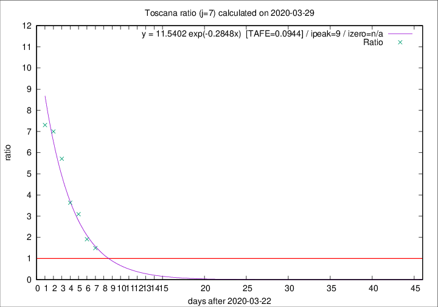

# Toscana

Data source: https://raw.githubusercontent.com/pcm-dpc/COVID-19/master/dati-json/dpc-covid19-ita-regioni.json

Estimates in this page were made on 16/4/2020 with data available until 29/03/2020.

## Summary 

### Peak estimate 
|j|linear [TAFE]|exponential [TAFE]|power law [TAFE]|details|
|---|----|-----------|---------|-------|
|7|31/3/2020 [TAFE=0.1148]|1/4/2020 [TAFE=0.0944]|9/4/2020 [TAFE=0.2381]|[analysis](COVID-19_toscana_j7_2020-03-29.md)|
|8|31/3/2020 [TAFE=0.1483]|3/4/2020 [TAFE=0.1125]|23/4/2020 [TAFE=0.2174]|[analysis](COVID-19_toscana_j8_2020-03-29.md)|
|9|1/4/2020 [TAFE=0.1427]|7/4/2020 [TAFE=0.1789]|-|[analysis](COVID-19_toscana_j9_2020-03-29.md)|
|10|30/3/2020 [TAFE=0.4732]|6/4/2020 [TAFE=0.2122]|6/6/2020 [TAFE=0.2806]|[analysis](COVID-19_toscana_j10_2020-03-29.md)|
|11|-|-|-||
|12|-|-|-||
|13|-|-|-||
|14|-|-|-||

Best estimator is exp with j=7 (TAFE=0.0944)
Corresponding peak date estimate is 1/4/2020 (ipeak 9)

Peak date range estimate: 23/3/2020 - 9/6/2020

### End estimate 
|j|linear [TAFE/TFE]|exponential [TAFE/TFE]|power law [TAFE/TFE]|details|
|---|----|-----------|---------|-------|
|7|31/3/2020 [TAFE=0.1148]|-|-|[analysis](COVID-19_toscana_j7_2020-03-29.md)|
|8|-|-|-|[analysis](COVID-19_toscana_j8_2020-03-29.md)|
|9|-|-|-|[analysis](COVID-19_toscana_j9_2020-03-29.md)|
|10|-|-|-|[analysis](COVID-19_toscana_j10_2020-03-29.md)|
|11|-|-|-||
|12|-|-|-||
|13|-|-|-||
|14|-|-|-||

Best estimator is linear with j=7 (TAFE=0.1148)
Corresponding end date estimate is 31/3/2020 (izero 8)

End date range estimate: 23/3/2020 - 4/4/2020

Generated April 16th, 2020 at 20:09:19 UTC+0200 with https://github.com/robianc/COVID-19
