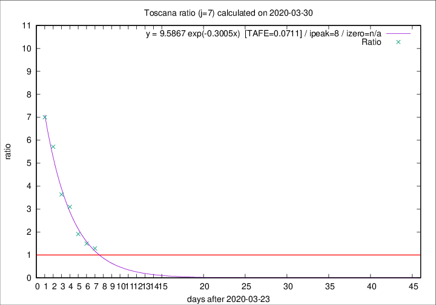
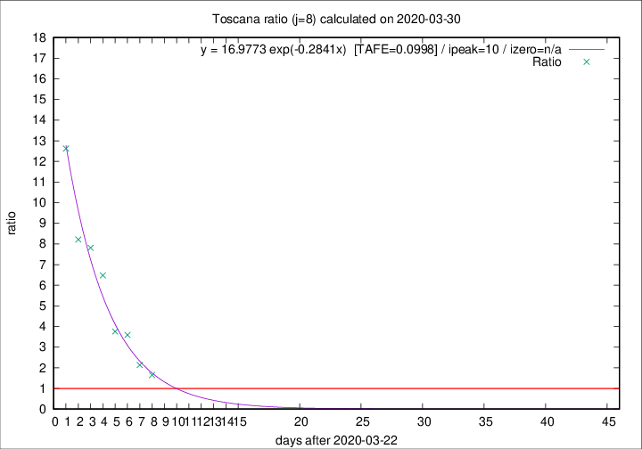

# Toscana

Data source: https://raw.githubusercontent.com/pcm-dpc/COVID-19/master/dati-json/dpc-covid19-ita-regioni.json

Estimates in this page were made on 8/4/2020 with data available until 30/03/2020.

## Summary 

### Peak estimate 
|j|linear [TAFE]|exponential [TAFE]|power law [TAFE]|details|
|---|----|-----------|---------|-------|
|7|31/3/2020 [TAFE=0.1951]|1/4/2020 [TAFE=0.0711]|4/4/2020 [TAFE=0.1577]|[analysis](COVID-19_toscana_j7_2020-03-30.md)|
|8|31/3/2020 [TAFE=0.1561]|2/4/2020 [TAFE=0.0998]|12/4/2020 [TAFE=0.2168]|[analysis](COVID-19_toscana_j8_2020-03-30.md)|
|9|1/4/2020 [TAFE=0.1611]|5/4/2020 [TAFE=0.1154]|3/5/2020 [TAFE=0.2851]|[analysis](COVID-19_toscana_j9_2020-03-30.md)|
|10|31/3/2020 [TAFE=0.5892]|6/4/2020 [TAFE=0.2082]|11/5/2020 [TAFE=0.2529]|[analysis](COVID-19_toscana_j10_2020-03-30.md)|
|11|31/3/2020 [TAFE=0.5144]|8/4/2020 [TAFE=0.2455]|-|[analysis](COVID-19_toscana_j11_2020-03-30.md)|
|12|-|-|-||
|13|-|-|-||
|14|-|-|-||

Best estimator is exp with j=7 (TAFE=0.0711)
Corresponding peak date estimate is 1/4/2020 (ipeak 8)

Peak date range estimate: 24/3/2020 - 14/5/2020

### End estimate 
|j|linear [TAFE/TFE]|exponential [TAFE/TFE]|power law [TAFE/TFE]|details|
|---|----|-----------|---------|-------|
|7|1/4/2020 [TAFE=0.1951]|-|-|[analysis](COVID-19_toscana_j7_2020-03-30.md)|
|8|1/4/2020 [TAFE=0.1561]|-|-|[analysis](COVID-19_toscana_j8_2020-03-30.md)|
|9|-|-|-|[analysis](COVID-19_toscana_j9_2020-03-30.md)|
|10|-|-|-|[analysis](COVID-19_toscana_j10_2020-03-30.md)|
|11|-|-|-|[analysis](COVID-19_toscana_j11_2020-03-30.md)|
|12|-|-|-||
|13|-|-|-||
|14|-|-|-||

Best estimator is linear with j=8 (TAFE=0.1561)
Corresponding end date estimate is 1/4/2020 (izero 9)

End date range estimate: 23/3/2020 - 3/4/2020

Generated April 8th, 2020 at 23:43:36 UTC+0200 with https://github.com/robianc/COVID-19
