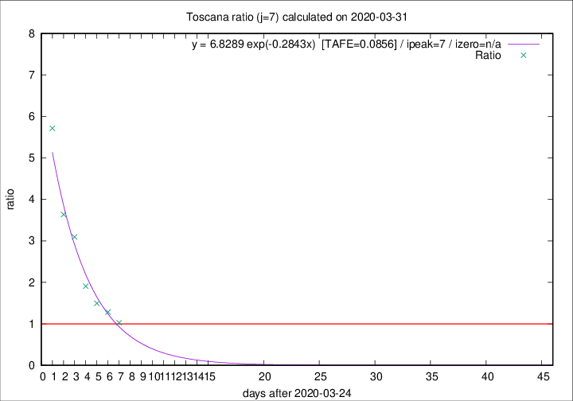

# Toscana

Data source: https://raw.githubusercontent.com/pcm-dpc/COVID-19/master/dati-json/dpc-covid19-ita-regioni.json

Estimates in this page were made on 8/4/2020 with data available until 31/03/2020.

## Summary 

### Peak estimate 
|j|linear [TAFE]|exponential [TAFE]|power law [TAFE]|details|
|---|----|-----------|---------|-------|
|7|1/4/2020 [TAFE=0.2387]|1/4/2020 [TAFE=0.0856]|3/4/2020 [TAFE=0.0816]|[analysis](COVID-19_toscana_j7_2020-03-31.md)|
|8|1/4/2020 [TAFE=0.1780]|2/4/2020 [TAFE=0.1005]|8/4/2020 [TAFE=0.2449]|[analysis](COVID-19_toscana_j8_2020-03-31.md)|
|9|1/4/2020 [TAFE=0.2474]|4/4/2020 [TAFE=0.0894]|17/4/2020 [TAFE=0.2481]|[analysis](COVID-19_toscana_j9_2020-03-31.md)|
|10|2/4/2020 [TAFE=0.1549]|6/4/2020 [TAFE=0.1691]|25/5/2020 [TAFE=0.3827]|[analysis](COVID-19_toscana_j10_2020-03-31.md)|
|11|31/3/2020 [TAFE=0.7703]|7/4/2020 [TAFE=0.1914]|12/5/2020 [TAFE=0.3060]|[analysis](COVID-19_toscana_j11_2020-03-31.md)|
|12|-|-|-||
|13|-|-|-||
|14|-|-|-||

Best estimator is pow with j=7 (TAFE=0.0816)
Corresponding peak date estimate is 3/4/2020 (ipeak 9)

Peak date range estimate: 25/3/2020 - 28/5/2020

### End estimate 
|j|linear [TAFE/TFE]|exponential [TAFE/TFE]|power law [TAFE/TFE]|details|
|---|----|-----------|---------|-------|
|7|2/4/2020 [TAFE=0.2387]|-|-|[analysis](COVID-19_toscana_j7_2020-03-31.md)|
|8|2/4/2020 [TAFE=0.1780]|-|-|[analysis](COVID-19_toscana_j8_2020-03-31.md)|
|9|-|-|-|[analysis](COVID-19_toscana_j9_2020-03-31.md)|
|10|2/4/2020 [TAFE=0.1549]|-|-|[analysis](COVID-19_toscana_j10_2020-03-31.md)|
|11|-|-|-|[analysis](COVID-19_toscana_j11_2020-03-31.md)|
|12|-|-|-||
|13|-|-|-||
|14|-|-|-||

Best estimator is linear with j=10 (TAFE=0.1549)
Corresponding end date estimate is 2/4/2020 (izero 11)

End date range estimate: 22/3/2020 - 2/4/2020

Generated April 8th, 2020 at 23:43:36 UTC+0200 with https://github.com/robianc/COVID-19
